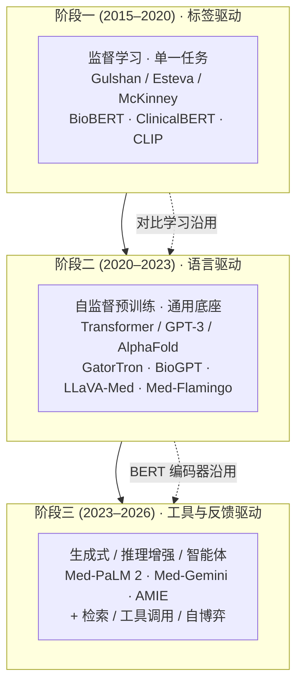
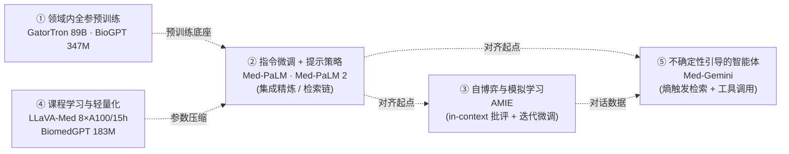
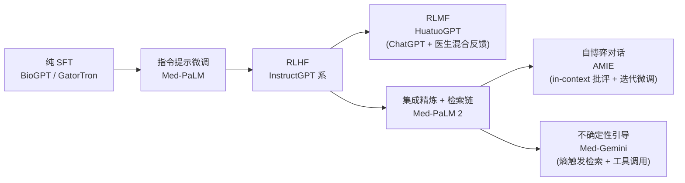
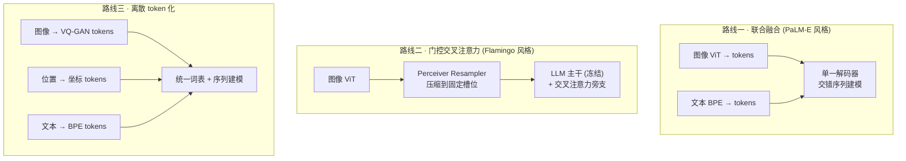
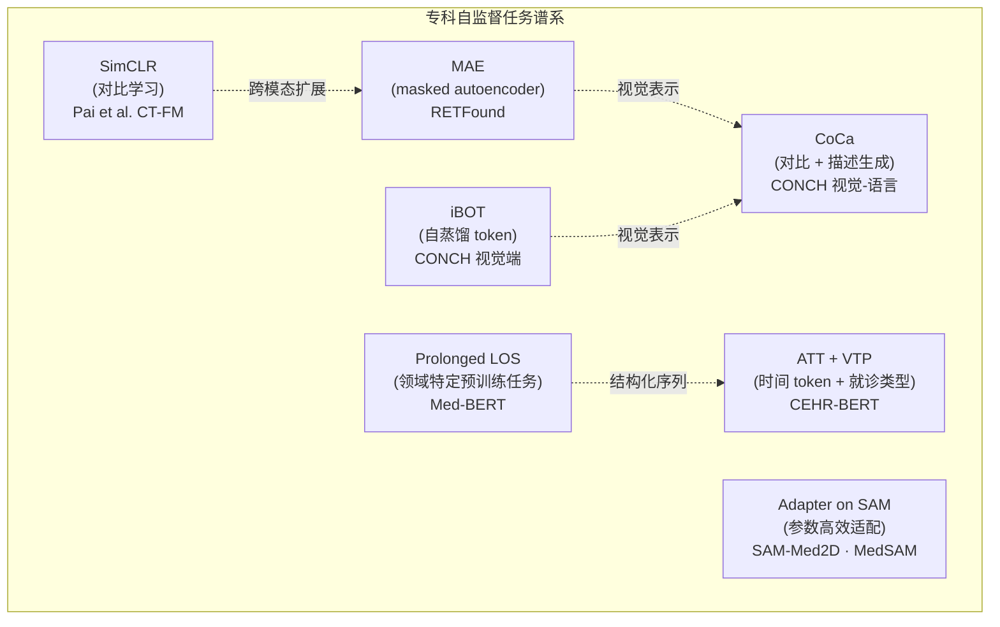
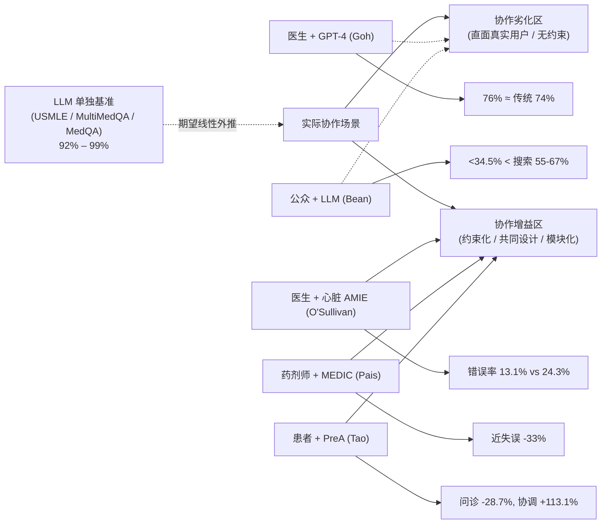
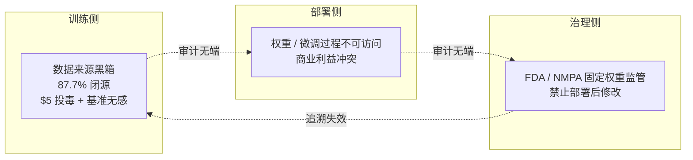
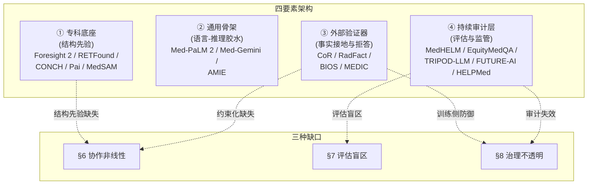

# 医疗人工智能与医疗大模型研究综述（2022–2026）

> **撰写日期**：2026-05-12
> **文献范围**：纳入 2026-04-30 以前公开发表或可信预印本
> **检索口径**：以 *Nature / Nature Medicine / NEJM AI / Nature Communications / npj Digital Medicine / The BMJ / JAMA Network* 以及 NeurIPS / NAACL / EMNLP 等顶会顶刊为主，辅以方向性技术报告（Med-Gemini、Med-PaLM、LLaVA-Med、Foresight 2 等）

---

## 摘要

过去四年，医疗人工智能在能力维度完成了三重转向：从任务专用监督学习到通用基础模型、从判别式输出到生成式交互、从单模态判别到多模态融合。以 GPT-4 / PaLM 2 / Gemini 与 LLaMA 系列为代表的大语言与多模态模型，将医学问答、影像报告生成、临床决策支持与患者沟通统一在生成式框架之下，并不断刷新 USMLE、MultiMedQA、MultiMedBench、MedHELM 等基准的纪录。然而，伴随能力扩张同时显现的是评估方法学、人机协作与训练治理三条配套坐标的滞后——多项随机对照试验（RCT）与系统综述揭示了一个反直觉现实：模型在静态考试上接近或超过医生水平，并不意味着在真实临床工作流中具有相同的可靠性。本综述沿"先描述路径、后诊断缺口、再综合修复"的单一脉络展开，依次梳理医疗 AI 的范式演进、医疗大语言模型、多模态医疗大模型与专科基础模型四块现状底色（§2–§5），继而以"通往可信临床部署的关键缺口"为线索揭示评估方法学、人机协作与训练治理三类结构性挑战（§6–§8），最后综合为"专科底座 + 通用骨架 + 外部验证器 + 持续审计层"的四要素修复架构与三条具体主张（§9–§10）。综述的核心立场是：医疗 AI 在能力维度的快速进展并未自动转化为临床效用，距离"能用、敢用、可监管"的目标仍有相当距离；通用化与专科化是互补关系而非进化阶段，评估科学需扩大评估空间的拓扑而非单纯提高题目难度，监管框架需以训练数据透明度为安全性的必要条件。

---

## 1 引言

医疗人工智能在过去四年经历了一段近乎压缩式的演进。以 ChatGPT 公开发布为起点的不到三十六个月内，专门面向医学问答的 Med-PaLM 在美国执业医师考试题集 MedQA 上的准确率由 67.6% 提高到 86.5%[^8][^13]，Med-Gemini 进一步把这一数字推至 91.1%，而当评测题被重新标注后甚至上移至 91.8–92.9%[^7]。同期，多模态医疗大模型从"接入图像"演化到"统一视-语-表-基因"，AMIE 在 OSCE 风格诊断对话中 30/32 个专家维度上显著优于全科医生[^17]，PreA 在两家三甲医院 2,069 名患者的 RCT 中把问诊时长降低近三成、把跨科室协调度提升超过一倍[^20]。这一系列数字让人很容易得出"医疗 AI 已经准备好走进诊室"的结论。

然而，一旦把视角从单项基准切换到真实临床工作流，画面便陡然复杂。Goh 等在 2024 年公开的 RCT 显示，GPT-4 单独完成诊断推理的准确率达到 92%，但当 50 位医生在 LLM 辅助下处理同样案例时，准确率仅有 76%——与不接触 LLM 的传统资源组（74%）无显著差异[^25]。Bean 等在 2026 年以 1,298 名公众用户开展的预注册研究进一步发现，三款主流 LLM 在脱离用户的封闭设置下识别 10 类病症的准确率高达 90.8–99.2%，但真实公众用户经 LLM 辅助后病症识别率反而显著低于不使用 LLM 的对照组[^26]。Chen 等同年发表于 *Nature Medicine* 的 LLM 辅助系统综述更以宏观数据印证了这种"数量与质量错位"——2022 年 1 月至 2025 年 9 月，临床医学领域累计发表关于 LLM 的研究约 4,609 篇，平均 3.2 篇/天，但其中真正具备前瞻性 RCT 性质的不足 19 篇，约 25% 的研究样本量低于 30，闭源模型占比高达 87.7%[^1]。

这一组数字共同勾勒出本综述要回答的核心张力：医疗 AI 的能力曲线呈指数增长，而临床证据、评估方法、治理框架三条曲线只是线性增长。综述要解释的不是"AI 多强"，而是"为什么我们对'多强'的判断如此不可靠"——以及，朝向真正可信、可部署、可监管的医疗 AI 还需补上哪几块结构性短板。

围绕这一张力，本综述以发展路径与能力图景为底色，以结构性缺口与修复方向为诊断，共划分十章在同一脉络下顺次推进：第 2 章梳理 2015–2026 年医疗 AI 在训练目标、模型规模、模态广度三条主轴上的演进；第 3 章对比英文与中文医疗大语言模型的能力图景及其评估同步演进；第 4 章描绘多模态医疗大模型的架构谱系与数据-评估失衡；第 5 章论证专科基础模型在结构化电子健康记录（EHR）时序、影像、组学等任务上仍占据不可替代位置——前四章共同回答"医疗 AI 已经走到了哪里"。第 6 章以近 24 个月的真实临床 RCT 为材料，揭示"独立模型强 ≠ 人机协作强"的协作非线性；第 7 章追踪医疗 AI 评估方法学在任务、维度、被试三个面上的同时位移；第 8 章诊断训练数据、闭源生态、监管框架三处不透明环节如何让事后审计失效——这三章回答"它距离能被信任地部署还有多远"。第 9 章把上述诊断综合为"专科底座 + 通用骨架 + 外部验证器 + 持续审计层"的四要素修复架构；第 10 章作为结论给出综述者的三条具体主张。

**图 1.1 综述总体结构**

> 图 1.1 注：§1–§5 描绘"路径与图景"，对应研究问题 Q1–Q3；§6–§8 展开"诊断"，对应研究问题 Q4；§9 给出修复架构、§10 收束综述者立场，共同对应研究问题 Q5。十章在同一论证链上顺次推进，无须分卷。

具体而言，本综述围绕以下五个研究问题展开：

- **Q1（技术演进）**：医疗 AI 在 2015–2026 年的范式跃迁经历了哪些关键阶段，其底层动力是什么？
- **Q2（能力图景）**：医疗大语言模型与多模态大模型在当下达到了怎样的能力上限，英文与中文两条路线呈现何种互补结构？
- **Q3（专科 vs 通用）**：在哪些子领域专科基础模型仍系统性优于通用大模型？通用化在何种意义上是有代价的？
- **Q4（临床证据 vs 评估）**：近 24 个月的 RCT 证据如何重塑我们对协作收益、评估方法学的理解？
- **Q5（治理与修复）**：训练数据不透明、闭源生态与监管脱节如何放大医疗 AI 的系统性风险？可工程化的修复路径是什么？

在术语口径上，本综述将"医疗大语言模型"（Medical LLM）界定为以自然语言为主输入输出、参数规模在十亿量级以上、并在医学语料上做过领域适配（继续预训练 / 指令微调 / 强化学习）的语言模型；将"多模态医疗大模型"（Medical LMM / VLM）界定为在文本之外能接受影像、生物信号、结构化 EHR、组学等至少一种模态作为输入的大模型；将"专科基础模型"界定为在单一医学子领域（如眼底、病理、CT、EHR 时序）上经自监督预训练并在该子领域多类下游任务上展现可迁移性的模型。"医疗 AI"作为更广义的伞形术语，涵盖上述三类与传统任务专用监督模型。"基准成绩"在本综述中专指静态问答或分类基准上的指标（如 MedQA 准确率），与之相对的是"临床效用"——即在真实临床工作流中以临床终点（如再入院率、误诊率、问诊时长）度量的指标。这一组区分将贯穿全文，是后续 §6–§8 诊断框架的语义基础。

---

## 2 范式演进回顾：从任务专用监督到生成式智能体

医疗 AI 在 2015–2026 年的演进可以被组织为三个相互衔接而非简单替代的阶段（图 2.1）。其底层动力是训练目标的两次跃迁——从"标签驱动"经"语言驱动"再到"工具与反馈驱动"——三次跃迁分别为模型解锁了不同的能力边界，但前阶段的方法学并未随之退场，而是被纳入新阶段作为模块继续发挥作用。这一观察是后续讨论"通用与专科互补"的方法论起点。

**图 2.1 三阶段训练目标演化**

> 图 2.1 注：三阶段并非简单替代，虚线表示前阶段方法学在后阶段中作为模块沿用——对比学习成为阶段二多模态对齐组件，BERT 风格双向编码器在阶段三中作为检索召回端或专科编码器继续发挥作用。这一沿用关系是 §5 论证"专科基础模型不可替代位置"的方法学基础。

### 2.1 阶段一：任务专用监督学习（约 2015–2020）

这一阶段以"高质量标注 + 卷积/循环网络 + 端到端监督"为核心方法学。Gulshan 等以 12.8 万张视网膜图像训练 InceptionV3，在糖尿病视网膜病变筛查上达到与眼科医师相当的灵敏度与特异性；Esteva 等以 12.9 万张皮肤镜图像训练 GoogLeNet 完成 2,032 种皮肤病变的细粒度分类；McKinney 等以英国与美国两国筛查数据训练乳腺癌检测模型，在前瞻验证中减少假阳性 5.7% / 假阴性 9.4%[^3]。截至本综述撰写时，美国 FDA 已批准超过 500 项 AI/ML 医疗器械软件（SaMD），其中绝大多数仍属本阶段方法学的产物——单一模态、单一任务、强监督依赖、训练数据规模在十万至百万量级[^3]。

阶段一最重要的方法学遗产有三：其一，**对比学习**（CLIP/ConVIRT）开始替代纯监督，将影像 - 报告对作为弱监督信号，为阶段二的多模态对齐组件提供了直接前身；其二，**BERT 风格的双向编码器**经 BioBERT / ClinicalBERT 适配进入医学文本处理，奠定了后续 GatorTron / Med-BERT 等模型的技术基线[^9]；其三，**回顾性验证范式**（基于固定测试集的 AUC 报告）作为评测协议被广泛接受，这一范式的局限将在第 7 章被批判性回顾。

### 2.2 阶段二：基础模型与多模态融合（2020–2023）

这一阶段以"自监督预训练 + 通用底座 + 跨任务迁移"为核心方法学。Transformer、AlphaFold、CLIP、GPT-3 共同构成本阶段的四块基础设施：Transformer 把"序列建模"统一为一种可扩展至跨模态的通用架构；AlphaFold 证明了大规模自监督在生物分子结构上的强迁移性；CLIP 把"图像 - 文本"对比作为可扩展的视觉表示学习目标；GPT-3 则首次展示出在不更新权重的情况下通过提示完成跨任务推理的零/少样本能力[^4]。

在这一基础上，Acosta 等于 2022 年提出"多模态生物医学 AI"（Multimodal Biomedical AI）概念框架，将精准组学健康、数字化临床试验、远程监护、大流行病监测、数字孪生与虚拟健康助手六类应用纳入统一视角[^5]；Moor 等于 2023 年在 *Nature* 提出"通用医疗 AI"（Generalist Medical AI, GMAI）框架，将通用医疗模型的三大核心能力概括为"动态任务指定"、"灵活多模态输入输出"与"医学领域知识表示"[^6]。GMAI 与多模态生物医学 AI 共同确立了阶段二的目标函数——不再追求"在某一任务上达到医生水平"，而是追求"在尽可能广的任务谱系上以同一权重保持可用"。

代表性体系亦在这一阶段集中出现。语言侧，GatorTron 以 820 亿临床笔记词、60 亿 PubMed 词、25 亿 Wiki 词从头训练至 89B 参数，在临床推理任务上相对 BioBERT 提升约 9.5–9.6%[^9]；BioGPT 在 1500 万 PubMed 摘要上从头训练 GPT-2 Medium，PubMedQA 准确率达 78.2%[^10]。多模态侧，LLaVA-Med 在 600K 图文对齐 + 60K 自指令对话的两阶段课程下，仅以 8 张 A100、不足 15 小时即完成训练，在生物医学视觉问答任务上达到与远大模型相当的性能[^11]；Med-Flamingo 以 OpenFlamingo + LLaMA-7B 为骨架，构造了从 4,721 本医学教科书抽取的 MTB 数据集（80 万图、5.84 亿 tokens），首次在医学多模态中验证了少样本上下文学习（ICL）的可行性[^12]。

### 2.3 阶段三：生成式 AI 与智能体（2023–2026）

ChatGPT 在 2022 年末引爆公众关注之后，医疗 AI 的方法学焦点迅速从"基础模型"转移到"生成式接口 + 工具调用 + 推理增强"。Med-PaLM 系列是这一阶段的开局之作：Singhal 等在 540B Flan-PaLM 上仅通过指令提示微调（更新约 65 个软提示参数）即将科学共识一致率从 61.9% 提升至 92.6%，接近临床医生的 92.9%[^8]；其后的 Med-PaLM 2 在 PaLM 2 基础上引入"集成精炼"（Ensemble Refinement）与"检索链"（Chain of Retrieval）两项推理增强机制，MedQA 准确率达到 86.5%，并在 9 个临床轴中的 8 个上获得医生评审者偏好[^13]。

Med-Gemini 进一步把方法学边界推到"基于不确定性的自主搜索"——当模型输出 token 的 Shannon 熵超过阈值时自动触发网络检索，把外部知识接地纳入推理回路；同时利用 Gemini 1.5 的 1M+ token 上下文窗口，使模型可直接解析完整电子病历或手术视频，无需 RAG 切片[^7][^16]。AMIE 则把"自博弈 + 模拟学习"作为方法学创新点：在 PaLM 2 基础上，内循环以 in-context 批评反馈优化对话，外循环以迭代微调更新权重，模拟覆盖 5,230 种疾病的多轮问诊场景，最终在 159 例 OSCE 风格双盲交叉研究中以 30/32 个专家维度与 25/26 个患者维度显著优于 20 名全科医生[^17]。

值得注意的是，阶段三的几条主要技术路径并非彼此独立，而是在同一年代相互渗透。一方面，推理增强（如 DeepSeek-R1 与 OpenAI o-series 的链式思维 / 测试时计算）开始进入医疗领域，与传统的指令微调形成互补；另一方面，工具调用与智能体协议（function calling、Computer Use 等）让模型从"纯权重模型"转向"带工具的智能体"，O'Sullivan 等 2026 年发表的心脏专科 AMIE 即是这一范式的具体落地——以 Gemini 2.0 Flash 为底座、配套领域工具与多步推理，仅在 9 例真实病例上做开发即完成 107 例 HCM / 心肌病的随机交叉部署，显著错误率较单纯专家组下降近一半[^19]。Teo 等在 *Nature Medicine* 2025 年的综述中将这一阶段的方法学谱系总结为"合成数据系统（VAE/GAN）→ 扩散模型 → 规则型 AI → LLM → 多模态基础模型 → 推理 / 智能体 → 模型蒸馏"，提示阶段三的核心特征不是任何单一技术，而是**多种生成式方法在同一医疗任务上的并置与组合**[^7]。

### 2.4 训练范式的横向剖面

把上述三阶段在训练范式上做横向切片，可以辨识出五种相互交叠、并在阶段三同时被广泛使用的范式（图 2.2）。

**图 2.2 五种训练范式的张量空间**

> 图 2.2 注：五种训练范式在张量空间中并非互斥而是正交切片——同一模型常同时占据多个范式位置。例如，AMIE 在自博弈之外也使用指令微调与不确定性表征；Med-Gemini 在不确定性引导之外也复用 Med-PaLM 2 的检索链思想。虚线表示范式间常见的复用与衔接路径。

第一种是**领域内全参数预训练**——以 GatorTron[^9] 与 BioGPT[^10] 为代表，强调在领域语料上从零或近零开始学习参数，优势是领域分布最接近，劣势是计算成本极高且难以兼容多模态扩展。第二种是**指令微调与提示策略**——以 Med-PaLM 系列[^8][^13] 为代表，强调在大型通用基础模型上仅以少量医学示例做指令对齐，必要时辅以集成精炼、检索链等组合方法，是阶段三性价比最高、被复用最广的方案。第三种是**自博弈与模拟学习**——以 AMIE[^17] 为代表，强调以模型自身扮演的"批评者"或"患者"角色构造大规模合成对话数据，从而绕开真实医患对话的隐私与规模限制。第四种是**课程学习与轻量化**——以 LLaVA-Med[^11] 与 BiomedGPT[^15] 为代表，强调以阶段式课程与离散 token 化把模型规模压缩到学术资源可承受的范围（前者 8 卡 / 15 小时，后者 183M 参数即达 25 项任务 16 项 SOTA）。第五种是**不确定性引导的智能体**——以 Med-Gemini[^7] 为代表，强调把推理时计算与外部工具调用纳入训练目标，使模型在低置信度时主动检索而非过度自信地生成。

这五种范式并非彼此排斥。AMIE 在自博弈的同时也使用了指令微调与不确定性表征；Med-Gemini 在不确定性引导的同时也复用了 Med-PaLM 2 的检索链思想。综述者认为，对医疗 AI 的训练范式更恰当的理解，是把上述五种视为一个**正交张量空间中的不同切片**，而非"哪种范式胜出"的零和竞争。

### 2.5 技术里程碑时间表

表 2.1 给出 2017 年至 2026 年医疗 AI 关键里程碑的时间表，其纵向阅读对应三阶段的演进，横向阅读对应训练范式的多样化。

**表 2.1 医疗 AI 关键里程碑（2017–2026）**

| 时间 | 里程碑 | 所属阶段 | 主要贡献 / 意义 |
|---|---|---|---|
| 2017 | Transformer[^A] | 阶段二基础设施 | 跨模态统一架构基础 |
| 2018–2019 | BERT / BioBERT / ClinicalBERT[^A] | 阶段一→二 | 生物医学双向编码器，迁移学习起点 |
| 2020 | GPT-3 / CLIP / AlphaFold[^4][^A] | 阶段二基础设施 | LLM / 视觉对比 / 蛋白结构三大基石 |
| 2021 | Med-BERT[^30] / CEHR-BERT[^31] | 阶段一→二 | 结构化 EHR 预训练，奠定专科基础模型路线 |
| 2022 | GatorTron[^9] / BioGPT[^10] / Multimodal Biomedical AI[^5] | 阶段二 | 域内规模定律首次验证；多模态综述框架 |
| 2022 | ChatGPT[^A] | 阶段二→三 | 引爆生成式医疗 AI 范式 |
| 2023 | GMAI[^6] / Med-PaLM[^8] / LLaVA-Med[^11] / Med-Flamingo[^12] / RETFound[^32] | 阶段三起点 | 通用医疗 AI 框架、医学 LLM 与多模态 VLM 并行突破；首个眼科自监督基础模型 |
| 2023 | HuatuoGPT[^33] / BianQue[^34] / DISC-MedLLM[^35] / SAM-Med2D[^36] | 阶段三 | 中文医疗 LLM 路线启航；分割基础模型扩展至 10 模态 |
| 2024 | Med-PaLM 2[^13] / Med-Gemini[^7][^16] / BiomedGPT[^15] / MAIRA-2[^24] / CONCH[^37] / CT-FM (Pai)[^38] / MedSAM[^39] / EquityMedQA[^40] | 阶段三 | 多模态 + 长上下文 + 不确定性引导；专科基础模型扩展至病理 / CT；首个医疗 LLM 公平性工具箱 |
| 2024 | Foresight 2[^41] / AMIE[^17] | 阶段三 | EHR 时序专科 LLM；自博弈对话诊断 |
| 2025 | MetaMedQA[^2] / MedHELM[^18] / FUTURE-AI[^42] | 阶段三评估转向 | 元认知评估、整体性评估、国际可信 AI 共识 |
| 2026 | 心脏专科 AMIE[^19] / PreA RCT[^20] / 心理治疗认知层[^21] / Bean RCT[^26] | 阶段三临床证据 | 真实临床 RCT 集中涌现 |

[^A]: 时间线背景节点引自 Acosta 等[^5]、Moor 等[^6]、Thirunavukarasu 等[^22]、Teo 等[^7]的综述以及通用 AI 文献基础。

### 2.6 章节小结

三阶段的演进并不是一条"专科被通用替代"的单向链条。阶段一的对比学习经 CLIP/ConVIRT 演化，成为阶段二多模态对齐的主流组件；阶段二的 BERT 风格双向编码器在阶段三中以检索召回端或专科编码器形式继续发挥作用，Med-BERT、CEHR-BERT、RETFound、CONCH 等专科基础模型即是这一脉络在 2021–2024 年的延续；阶段一的回顾性验证范式则仍然作为绝大多数医疗 AI 论文的评测协议在使用，这一惯性也是第 7 章将批判性回顾的对象。把医疗 AI 的演进描述为"一次替代式跃迁"是误读——更准确的描述是**多代方法学在同一技术堆栈中的层级化叠加**。这一观察直接为第 5 章关于"专科基础模型不可替代位置"的论证铺路，也是 §9"四要素修复架构"中专科底座一项的方法学来源。

---

## 3 医疗大语言模型的能力图景

医疗大语言模型在过去三年完成了从"通用底座 + 领域微调"向"通用底座 + 推理时计算 + 工具调用"的过渡。在这一过渡中，主流体系并未沿单一技术路径展开，而是分化为三条相互渗透的能力路线——**指令微调与提示策略、不确定性与推理增强、自博弈与模拟学习**。以英语为主导的体系（Med-PaLM 家族、Med-Gemini、AMIE）在 USMLE 风格的静态基准上已经接近性能上限；以中文为主导的体系（HuatuoGPT、BianQue、PULSE、DISC-MedLLM）则把"完成一次合规多轮问诊"作为产品形态，在主动追问、共情表达与本地诊疗指南覆盖上发展出与英文路线明显不同的方法学侧重。两条路径并非彼此竞争，而是共同构成了当下医疗 LLM 的完整能力图景。

### 3.1 路线一：指令微调与提示策略

这条路线的核心理念是——把大量的医学领域适配工作放在"对齐"而非"重新预训练"上，从而最大化通用基础模型的语言能力红利。其代表性序列由 Med-PaLM[^8] 与 Med-PaLM 2[^13] 构成。Singhal 等在 540B Flan-PaLM 之上仅通过指令提示微调更新约 65 个软提示参数，便使模型在 MedQA(USMLE) 上的准确率由 50.3% 提升至 67.6%，并将"科学共识一致率"由 61.9% 推高至 92.6%，接近临床医生的 92.9%[^8]。同期由 Med-PaLM 团队构建的 **MultiMedQA** 评估集——整合 MedQA、MedMCQA、PubMedQA、MMLU 临床子集、LiveQA、MedicationQA 与 HealthSearchQA 共计 3,173 题——成为这一阶段事实上的标准基准，并配套引入了"科学共识一致性 / 不当内容 / 遗漏 / 危害程度 / 偏见"五个维度的临床医生人工评估框架。

Med-PaLM 2 在 PaLM 2 基础上叠加两项关键推理增强：**集成精炼（Ensemble Refinement）** 通过多路并行推理 + 综合输出降低单一采样的偶然性；**检索链（Chain of Retrieval）** 将初始答案拆分为若干可验证子声明，逐项调用搜索完成事实接地。这两项机制使其在 MedQA 上达到 86.5%，并在 9 个临床轴中的 8 个上获得医生评审者偏好（均 P<0.001）[^13]。值得注意的是，Med-PaLM 2 的评估范式较 Med-PaLM 进一步升级——从单边评分演化为**配对排名**——这一升级直接催生了第 7 章将详述的 MedHELM 评估架构。

### 3.2 路线二：不确定性引导与推理增强

当指令微调把静态准确率推近基准上限后，模型的"剩余错误"主要表现为**过度自信的事实捏造**——在低置信度区间仍以高置信度生成内容。Med-Gemini 系列以此为切入点，把训练目标从"提升正确率"转向"在不确定时主动检索"[^7]。其核心机制是基于输出 token 的 Shannon 熵触发外部搜索：当模型对下一 token 的预测分布过于平坦时，自动调用网络检索，把外部知识接地纳入推理回路。Med-Gemini 在 MedQA(USMLE) 上取得 91.1% 的准确率；更具方法论意义的是，当 Med-Gemini 团队对评测题做了重新标注（修复原题中的错答与歧义）后，SOTA 准确率移动至 91.8–92.9%——这一观察直接说明**评测瓶颈已经从"模型能力"转移到"标注质量"**，是阶段三评估范式转向的一个早期信号。

Med-Gemini 的另一项关键设计是利用 Gemini 1.5 的 1M+ token 上下文窗口直接解析完整电子病历或手术视频，从而把检索增强生成（RAG）中的"切片-召回-拼接"步骤大幅简化为"上下文塞入"[^7]。这一设计在概念上把"模型 + RAG"两段式架构压缩为"模型 + 上下文 + 工具调用"三层架构，是从"语言驱动"过渡到"工具与反馈驱动"的具体落地范例。其 2D / 3D / Polygenic 扩展[^16] 则展示了这一架构在多模态长尾任务上的延展能力，将在 §4 进一步讨论。

### 3.3 路线三：自博弈与模拟学习

第三条路线由 Tu 等提出的 AMIE 代表[^17]。AMIE 的方法学创新点在于以"自博弈"绕开真实医患对话数据的隐私与规模约束：在 PaLM 2 基础上，模型同时扮演"医生"与"模拟患者"两个角色，内循环通过 in-context 批评机制对每一轮对话进行即时反馈，外循环则将累积的高质量对话作为新的微调数据迭代更新权重。模拟覆盖 5,230 种疾病的多轮问诊场景。在 159 例 OSCE 风格双盲交叉研究中，AMIE 以 30/32 个专家维度与 25/26 个患者维度显著优于 20 名全科医生（GP）；尤其在"鉴别诊断推理"与"管理建议合理性"两个维度上，AMIE 的优势超过 0.5 个李克特量级。

AMIE 的方法学价值不限于"模型超过医生"这一论断——更重要的是它把**模拟学习的合规边界**纳入主流方法学的讨论：与依赖真实医患对话训练的中文路线相比，自博弈在不接触患者隐私的前提下生成了功能近似的训练信号；但与之相伴的代价是模拟分布与真实分布之间的潜在偏差，这一代价将在 §6 中通过 Goh 等[^25] 与 Bean 等[^26] 的 RCT 证据被进一步剖析。

### 3.4 中文医疗大语言模型：另一种问题设定

英文体系把"通过 USMLE / 增益医生工作流"作为里程碑，因而长于"应答能力"；中文体系则把"完成一次合规多轮问诊"作为产品形态，因而长于"主动追问能力"——这一差异不仅是评估目标的差异，更是**问题设定**的差异，并由此孕育出方法学层面的独立创新。

HuatuoGPT 是这一路线的代表性早期工作[^33]。Zhang 等观察到，当时医疗 LLM 要么纯粹蒸馏自 ChatGPT（导致"模型崩溃"、缺乏专业诊断能力），要么仅训练于真实医患对话（回复简短、不够友好），两类数据各有优劣但互补。他们提出"混合数据 SFT + 混合反馈强化学习（RLMF）"的双重融合架构：前者同时利用 ChatGPT 蒸馏数据（指令跟随、流畅表达）与真实医患对话数据（专业诊断、主动追问），后者由 ChatGPT 与人类医生联合提供奖励信号。HuatuoGPT 基于 LLaMA-13B（Ziya-LLaMA 预训练初始化）训练，在多轮对话评估中对 DoctorGLM 胜率 97%、对 ChatGPT 胜率 62%，在 cMedQA2、webMedQA、Huatuo-26M 三个中文医疗 QA 基准上 BLEU/ROUGE 等指标排名第一，在 cMedQA2 上甚至超越微调后的 T5。

BianQue 进一步把"主动追问"明确为一种独立能力，提出**Chain of Questioning（CoQ）** 概念[^34]。Chen 等指出，真实临床场景中医生需通过多轮问诊逐步了解患者状况后才给出个性化建议；当时的中文医疗 LLM 因训练数据中缺乏多轮追问样本而"只会建议、不会提问"。BianQue 团队构建了 243 万条多轮健康对话数据集 BianQueCorpus，通过 ChatGPT 对真实医患对话中医生建议做润色，保持问题与建议的比例约为 46.2% : 53.8%；以 ChatGLM-6B 为底座做全参数微调，BianQue 在 MedDG 数据集上 BLEU-1 达 14.86（vs ChatGPT 5.11）、ROUGE-L 达 19.56（vs 5.46）、自定义的 PQA（Proactive Questioning Ability）指标达 0.81（vs ChatGPT 0.63）。

PULSE 与 DISC-MedLLM 进一步把中文路线扩展到更大规模与更系统的偏好对齐。PULSE 由上海人工智能实验室 OpenMEDLab 团队发布，以 BLOOMZ-7B 与自研中文基座扩展版本为底座，在约 400 万条中文医学指令数据（涵盖医学问答、医患对话、医学知识图谱问答、医考真题、电子病历摘要等）上做监督微调，在中国国家医师资格考试题库 MedQA-MCMLE 与中文综合医学基准 CMB 上压制同期开源中文通用 LLM[^43]。DISC-MedLLM 由复旦大学团队基于 Baichuan-13B-Base 构建，DISC-Med-SFT 数据集通过三条管线生成约 47 万条样本——真实医患对话改写、医学知识图谱 CMeKG 三元组转 QA、以及人类偏好对齐数据；其多轮一致性与"行为得分"超过 HuatuoGPT、BianQue 与中文 GPT-3.5[^35]。

中文路线的评估生态亦在同步成熟。Wang 等于 NAACL 2024 主会发表的 **CMB** 覆盖六大临床工种、中医、药剂、护理等子领域，并按照中国医师资格考试结构设计层级化任务[^44]；其后的 CMExam（约 6 万题、五维结构化知识点）与 MedBench（上海 AI 实验室）进一步加入了临床安全维度。值得指出的是，CMB / MedBench 中"中医"与"医保政策"等本地化任务的存在，使中文医疗基准与 MultiMedQA / MedHELM 形成了非平凡的结构性差异——这是 §7"评估的英语偏倚"小命题的直接证据。

### 3.5 早期 NLP 基础与评估同步演进

需要补充说明的是，阶段三的医疗 LLM 并非凭空出现，其方法学血脉直接承接阶段二的两个里程碑——GatorTron 与 BioGPT。Yang 等[^9]训练的 GatorTron 把"领域内全参预训练"的规模法则首次验证到 89B 参数级，在 NLI、临床问答等任务上相对 BioBERT 提升约 9.5–9.6%；Luo 等[^10]训练的 BioGPT 把生成式预训练首次应用于生物医学文本（1500 万 PubMed 摘要），PubMedQA 准确率达 78.2%。这两项工作是后续 Med-PaLM 系列、HuatuoGPT、Foresight 2 等模型不同程度上的方法学先驱。

评估范式的演进与上述能力扩张同步发生：从 Med-PaLM 时代的 MultiMedQA[^8]（5 维医生人工评估 + 多任务静态准确率）到 Med-PaLM 2 时代的配对排名[^13]（9 临床轴 + 医生 / 真实回答对照），再到本综述 §7 将详述的 MedHELM[^18]（5 大类 22 子类 121 任务）——评估方法学的每一次升级都直接回应了模型能力的某一具体扩张。这种"模型-评估"协同演进，是医疗 LLM 之所以能在三年内连续刷新基准而尚未完全暴露临床效用缺口的方法学原因，同时也是 §7 将批判性回顾的重点。

### 3.6 章节小结

表 3.1 把上述四条路线的代表性模型并置对比，可见同一阶段内的方法学多样性远大于阶段间的方法学差异——AMIE 与 Med-PaLM 2 的差距小于 Med-PaLM 2 与 GatorTron 的差距，DISC-MedLLM 与 HuatuoGPT 的方法学距离也明显小于二者与 BiomedGPT（§4 详述）的方法学距离。这一观察提示**当下医疗 LLM 的能力上限不再由"底座大小"单独决定，而是由训练目标、对齐数据与推理时计算的三元组共同决定**。

中英文路线的并行存在则给出一条更为重要的方法学线索：**目标场景的差异比技术代差更能解释模型行为的差异**。当英文社区把"通过 USMLE / 给医生工作流增益"作为里程碑时，它的方法学投资集中在静态问答与文档生成；当中文社区把"完成合规多轮问诊"作为产品形态时，它的方法学投资集中在主动追问、共情表达与本地诊疗指南覆盖。CoQ、RLMF 等概念正是这种问题设定差异孕育的方法学独立创新。这一观察将在 §7 升级为"评估的英语偏倚"小命题，也为 §9 修复架构中"通用骨架需以本地化数据二次适配"提供了直接论据。

**表 3.1 代表性医疗大语言模型横向对比**

| 模型 | 年份 | 主干 | 训练 / 对齐数据 | 关键贡献 | 代表性结果 | 目标场景 |
|---|---|---|---|---|---|---|
| BioGPT[^10] | 2022 | GPT-2 Medium 347M | 1500 万 PubMed 摘要 | 首个生物医学生成式 PT | PubMedQA 78.2% | 文献问答 |
| GatorTron[^9] | 2022 | Megatron-LM BERT | 820 亿临床笔记词 | 89B 临床域内全参预训练 | NLI 90.20% / MQA 93.10% | 临床 NLP |
| Med-PaLM[^8] | 2023 | Flan-PaLM 540B | 指令提示微调 (~65 软提示) | 多维医生评估 + MultiMedQA | MedQA 67.6% / 危害比例 5.9% ≈ 医生 5.7% | USMLE 风格问答 |
| Med-PaLM 2[^13] | 2025 | PaLM 2 | MedQA / MedMCQA / HSQA | ER + Chain of Retrieval | MedQA 86.5% / 9 轴 8 轴胜医生 | 工作流问答 |
| Med-Gemini[^7] | 2024 | Gemini 1.0 Ultra | 多模态混合 + 自训练 | 不确定性引导搜索 + 1M token | MedQA 91.1% / 重标后 91.8–92.9% | 长上下文 + 工具调用 |
| AMIE[^17] | 2025 | PaLM 2 | 真实对话 + 自博弈 | in-context 批评 + 迭代微调 | OSCE 30/32 专科维度优于 GP | 多轮诊断对话 |
| **HuatuoGPT**[^33] | 2023 | LLaMA-13B (Ziya) | Huatuo-26M + Med-Dialog + ChatGPT 蒸馏 | 混合数据 SFT + RLMF | vs DoctorGLM 胜率 97% / vs ChatGPT 62% | 中文多轮咨询 |
| **BianQue**[^34] | 2023 | ChatGLM-6B | BianQueCorpus 243 万 | Chain of Questioning (CoQ) | MedDG PQA 0.81 vs ChatGPT 0.63 | 主动追问问诊 |
| **PULSE**[^43] | 2023 | BLOOMZ-7B + 自研 20B | ~400 万中文医学指令 | 中文医考 + 中医 + 指南 | CMB / MedQA-MCMLE 领先开源中文通用 LLM | 中文医考与咨询 |
| **DISC-MedLLM**[^35] | 2023 | Baichuan-13B | DISC-Med-SFT 47 万 | 三管线数据 + 偏好对齐 | 多轮一致性优于 HuatuoGPT / BianQue / 中文 GPT-3.5 | 中文医疗对话 |

**图 3.1 训练目标演化（SFT → RLHF → RLMF → 自博弈 → 不确定性引导）**

> 图 3.1 注：图示展示了从纯监督微调到推理时计算的训练目标演化谱系，并非严格的时间顺序而是依赖关系。RLMF（HuatuoGPT）与 RLHF 平行而非串行；Med-PaLM 2 的检索链是 Med-Gemini 不确定性引导的方法学前身；AMIE 的自博弈机制则与不确定性引导共享"推理时反馈"的元思路。

---

## 4 多模态医疗大模型

如果说医疗大语言模型的演进是"在统一架构上做不同对齐"，那么多模态医疗大模型的演进则是"在统一目标上做不同接入"。**架构问题已经基本收敛**——三条主流融合路线在 MultiMedBench 等综合基准上的性能差距已小于 5 个百分点；竞争焦点已悄然转移到三个不对称——**模态可得性不对称、评估指标不对称、空间接地不对称**。这一节先梳理三条架构路线的方法学要点，再以 MAIRA-2 的 RadFact 评估为案例说明评估指标转向，最后给出关于"未来 24 个月最具回报率的工作"的综述者判断。

### 4.1 架构路线一：联合融合（PaLM-E 风格的 token 交错）

第一条路线把视觉编码器输出的 token 与文本 token 直接拼接，让单一解码器在交错序列上完成跨模态推理。Tu 等的 Med-PaLM M[^14] 是这一路线在医疗领域的旗舰落地——以 PaLM-E 为骨架，把 12B / 84B / 562B 三档参数规模分别在 MultiMedBench 的 14 任务上做统一权重训练，覆盖 MedQA、MedMCQA、PubMedQA、MIMIC-III RRS（放射报告摘要）、VQA-RAD、Slake-VQA、Path-VQA、MIMIC-CXR、PAD-UFES-20、VinDr-Mammo、CBIS-DDSM、PrecisionFDA V2 等基准；其 562B 版本在 14 任务中 14 项达到或接近 SOTA，是当时通用医疗多模态模型的能力上限。Med-PaLM M 的方法学贡献不在架构创新，而在 MultiMedBench 数据集本身——超过 100 万样本的多模态医疗任务集合至今仍是该领域最广覆盖的统一评估基准。

### 4.2 架构路线二：门控交叉注意力（Flamingo 风格的视觉旁支）

第二条路线保留 LLM 主干不变，通过 Perceiver Resampler 把视觉特征压缩到固定槽位，再以门控交叉注意力把视觉信息注入 LLM 的中间层。Moor 等的 Med-Flamingo[^12] 把这一路线引入医学领域：以 OpenFlamingo + LLaMA-7B 为骨架（共 8.3B 参数），从 4,721 本医学教科书抽取构建出 MTB（Medical Textbook Benchmark）数据集——80 万图、5.84 亿 tokens——用于继续训练。Med-Flamingo 的方法学贡献是首次在医学多模态领域验证**少样本上下文学习（ICL）** 的可行性：模型可在 4–8 个标注样本的提示下完成 PathVQA、VQA-RAD 等任务的零样本至少样本推理。其局限在于 PathVQA 等病理任务上的表现仍弱（受 LLaMA-7B 体量限制），且作为概念验证（PoC）未在临床场景落地。

### 4.3 架构路线三：离散 token 化与统一序列建模

第三条路线把所有模态——图像、文本、表格、位置——都映射到离散 token，让 Transformer 在统一词表上做序列建模。Zhang 等的 BiomedGPT[^15] 是这一路线的轻量化代表：以 OFA 框架为基础，用 VQ-GAN 把图像离散为视觉 token，与文本 BPE token 共享一个 59,457 维的统一词表，33M–182M 三档参数规模在 25 项任务中 16 项达到 SOTA。值得强调的是，182M 参数版本相对 562B 的 Med-PaLM M 在参数规模上缩小超过 3,000 倍，仍然在多项放射、病理、皮肤镜任务上保持接近 SOTA 的性能——这一对比为综述者关于"模型规模不再是能力上限唯一决定因素"的判断提供了直接证据。

Bannur 等的 MAIRA-2[^24] 把离散 token 化进一步扩展到**空间坐标**：100×100 网格坐标 token 编码病灶空间定位，使模型能够生成带句级 BBox 的"接地放射报告"（Grounded Radiology Report）。MAIRA-2 由 Vicuna + Rad-DINO 组合构建（约 7B 参数），在 MIMIC-CXR 上取得 BLEU-4 23.1、RadGraph-F1 34.6 等 SOTA，专家评审显示 91% 句子可以被临床医生直接接受。其方法学创新更重要的是配套提出的 **RadFact** 评估框架——下一节详述。

### 4.4 长上下文与模态扩展

在三条架构路线之外，Med-Gemini 系列把**长上下文窗口**作为多模态扩展的第四条独立路径[^7][^16]。Med-Gemini-M 1.5 支持 1M+ token 上下文，意味着模型可以直接在提示中容纳完整的电子健康记录、长视频或多张影像，而无需依赖 RAG 切片。Med-Gemini-2D 把 X 光、皮肤镜、眼底等 2D 模态接入；Med-Gemini-3D 把头颈 CT、肺部 CT 等三维体素数据通过切片采样接入并完成报告生成；Med-Gemini-Polygenic 则把基因组多基因风险评分（PRS）以零样本方式纳入预测——这是把"多模态"从图像扩展到组学的方法学尝试。值得指出，Med-Gemini-3D 在结构化报告生成任务上仍存在显著幻觉，CT-US1 等私有数据集的存在也使其结论可复核性受限——这一类问题将在 §8 训练-治理脆弱中被进一步剖析。

### 4.5 接地与可追溯：RadFact 作为评估指标转向的案例

多模态医疗报告生成长期以 BLEU、ROUGE、CIDEr 等基于词汇重叠的指标作为评估标准。这些指标在通用图像描述任务上尚可，但在医学报告中存在一个根本缺陷——**它们对错误的临床显著性无感**：把"无气胸"误写为"有气胸"与把"肺部清晰"换成"肺野清晰"在 BLEU 上可能产生相近的扣分，而临床后果天差地别。MAIRA-2 配套的 RadFact[^24] 是第一个针对这一缺陷做系统响应的评估框架——它用 Llama-3-70B 对模型生成的报告与参考报告做句级逻辑蕴含推断，给出四维评估：*逻辑精确率 / 召回率*（每个句子是否被参考报告蕴含 / 是否能蕴含某句参考）与 *空间精确率 / 召回率*（句级 BBox 与参考 BBox 的对应关系）。在 MIMIC-CXR 上，MAIRA-2 的 RadFact 逻辑精确率与召回率均显著高于 BLEU 等传统指标可分辨出的差异，并与放射科专家评分高度相关。

RadFact 的方法学意义超出 MAIRA-2 本身——它代表了**从"对齐指标"到"接地指标"** 的整体转向。这一转向是 §7 将系统讨论的"评估三重转向"中"维度面位移"的最早期范例之一。

### 4.6 章节小结

把三条架构路线、长上下文扩展、接地评估并置（表 4.1、图 4.1），可以看到一个清晰图景：**多模态医疗大模型的瓶颈已经从"如何把视觉接入 LLM"转向"如何让有限的数据 / 评估 / 接地基础设施跟上模型能力"**。

具体而言，这一瓶颈在三个维度上呈现不对称。第一是**模态可得性不对称**：CXR、皮肤镜、眼底等 2D 影像在 PMC-15M（1,500 万对图文）等公开数据中占主导，但病理、3D CT、心脏超声、内镜视频等模态长尾稀缺，往往只能在私有数据上训练，造成可复核性显著受损。第二是**评估指标不对称**：BLEU / ROUGE 仍是大多数论文的默认指标，而 RadFact 这类临床显著性加权评估仍仅在 MAIRA-2、CONCH 等少数体系中得到协议化。第三是**空间接地不对称**：MAIRA-2 的句级 BBox 接地在 MIMIC-CXR 上达到 SOTA，但在其他模态、其他任务上类似程度的接地仍属空白。

基于这三个不对称，综述者的判断是：**未来 24 个月最具回报率的工作不在新架构**，而在 (i) 病理、3D CT、心脏超声等长尾模态的多机构数据联盟；(ii) 临床显著性加权评估协议的标准化（沿 RadFact 路径扩展至病理、内镜、心电）；(iii) 跨模态空间接地的统一表示（候选包括坐标 token、注意力图、SAM-Med 等分割基础模型的提示融合，见 §5）。这一判断在 §9 的"四要素修复架构"中将以"专科底座 + 通用骨架"分工的形式被进一步具体化。

**表 4.1 代表性多模态医疗大模型横向对比**

| 模型 | 模态覆盖 | 规模 | 架构路线 | 突出贡献 | 关键局限 |
|---|---|---|---|---|---|
| LLaVA-Med[^11] | 文本 + 影像（CXR / CT / MRI / 病理） | 7B / 13B | 联合融合（视觉投影） | GPT-4 自指令 + 两阶段课程 / 8×A100 训练 <15h | 输入仅 224×224，幻觉显著 |
| Med-Flamingo[^12] | 文本 + 影像 | 8.3B | 门控交叉注意力 | MTB 80 万图、ICL 少样本 | PathVQA 弱，仅 PoC |
| Med-PaLM M[^14] | 文本 + CXR + 病理 + 皮肤 + 钼靶 + 基因组 | 12B / 84B / 562B | 联合融合（PaLM-E） | MultiMedBench 14 任务统一权重 | 未开源，缺前瞻验证 |
| BiomedGPT[^15] | 文本 + 2D 图像 + 表格 | 33M / 93M / 182M | 离散 token（VQ-GAN + 统一词表） | 全开源 + 轻量化（vs 562B 缩小 3,000+ 倍） | 零样本 VQA <60% |
| Med-Gemini-2D/3D/Polygenic[^16] | 2D 影像 + 3D CT + 基因组 | 未披露 | 长上下文 + 多模态 | 3D 报告生成、PRS 零样本 | 3D 幻觉，CT-US1 私有 |
| **MAIRA-2**[^24] | CXR + 历史片 + 临床文本 | ~7B (Vicuna + Rad-DINO) | 离散 token（空间坐标） | 句级 BBox 接地 + RadFact 评估 | 仅 CXR，51% 训练数据私有 |

**图 4.1 多模态融合的三条架构路线拓扑**

> 图 4.1 注：三条架构路线在 MultiMedBench 等综合基准上的性能差距已小于 5 个百分点，竞争焦点已转移到数据可得性、评估指标与空间接地三个不对称维度（见 §4.6）。MAIRA-2 选择路线三并叠加空间坐标 token；Med-Gemini 在路线二基础上叠加长上下文；Med-PaLM M 是路线一的旗舰；LLaVA-Med 与 BiomedGPT 分别是路线一与路线三的轻量化代表。

---

## 5 专科基础模型的不可替代位置

把 §2–§4 的讨论合在一起会很容易得到一个直觉式结论——既然通用基础模型在能力维度上不断刷新基准，专科监督学习时代的"小而专"路线是否已经被淘汰？这一节给出一个反向论证：**在结构化电子健康记录（EHR）时序、专科影像、组学预测等具备强结构先验的子领域，专科自监督基础模型在精度、样本效率与跨机构泛化三个维度上系统性优于通用多模态大模型；通用与专科不是进化前后关系，而是互补关系**。这一论断不仅是 §2–§4 现状底色之后的最后一块拼图，更直接为 §9"四要素修复架构"中"专科底座 + 通用骨架"双层设计提供方法学来源。

### 5.1 结构化 EHR 时序：从 Med-BERT 到 Foresight 2

医疗 AI 中最具结构先验的子领域是结构化 EHR——其本质是一组以患者为单位、按时间排序的 ICD / SNOMED / CPT / 药物编码序列，与自然语言相比有三个结构特征：**编码空间离散且封闭、时间间隔关键、患者间方差远大于编码方差**。这些特征决定了直接套用通用 LLM 在 EHR 上很难取得最优表现——这一判断在过去五年被三项标志性工作反复证实。

Rasmy 等的 Med-BERT[^30] 是这一路线的奠基性工作。他们在 Cerner Health Facts 数据库的 2,849 万患者诊断码序列上预训练了 1,700 万参数的 BERT 风格模型（6 层、隐层 192 维），核心方法学创新是**领域特定的预训练任务**——除标准 Masked LM 外，引入 *Prolonged Length-of-Stay*（延长住院时长预测）作为第二预训练目标，使模型学习跨就诊上下文的语义关系。在糖尿病合并心力衰竭（DHF）与胰腺癌（PaCa）两类下游任务的三个独立队列上，Med-BERT 较 Bi-GRU 基线提升 AUC 2.57–6.14 个百分点；尤为关键的是，**在 300 个样本的小数据场景下 Bi-GRU + Med-BERT 仍可达 AUC 0.75，等效于训练集扩大约 10 倍后的 Bi-GRU 性能**——这一样本效率优势在数据稀缺的罕见病预测中具有决定性意义。

Pang 等的 CEHR-BERT[^31] 把方法学进一步精细化。他们指出 BEHRT、Med-BERT 等模型把 EHR 视为文本序列时遗漏了**时间间隔**信息，并由此提出**人工时间标记**（Artificial Time Tokens, ATT）机制：把相邻就诊之间的时间间隔以离散 token 形式插入序列（如 `<7 days later>`），并以 time2vec 风格的 Fourier 编码同时融合概念、时间与年龄三种嵌入；同时以**就诊类型预测**（Visit Type Prediction, VTP）替代 BERT 原版 NSP 作为第二预训练目标。基于哥伦比亚大学医学中心 240 万患者 OMOP 数据预训练的 CEHR-BERT 在 T2DM→HF 预测上达到 AUC 80.7% / PR-AUC 32.3%，分别超 MedBert 约 2.5% / 5%；其中**仅用 5% 训练数据微调的 CEHR-BERT 仍能超越使用全量数据训练的所有对比模型**——再次印证结构先验在小数据场景下的乘数效应。

最具方法学冲击力的是 Kraljevic 等近期发表的 Foresight 2[^41]。他们的关键设计是**语境化患者时间线**——保留每个 SNOMED 概念被提及的原始文本上下文（含否定、修饰），并把 SNOMED 编码嵌入 LLM 分词器（以概念名称的 token 平均嵌入初始化），使 7B 规模的通用 LLM（Mistral-7B / LLaMAv2-7B）能够高效处理标准化医学本体的输入与输出。在 MIMIC-III 535 名患者的风险预测测试集上，Foresight 2 的 P@5（5 个预测中至少 1 个正确）达到 **0.90**，**显著高于 GPT-4-turbo 的 0.65**。这一对比直接说明：当 EHR 任务被恰当地结构化建模时，**7B 专科模型可以系统性压制远大于其规模的通用模型**。同样关键的是 Foresight 2 的上下文消融实验——移除患者时间线中的文本上下文（仅保留 SNOMED 概念序列）后，性能下降约 40%——这一数字定量地说明了"结构先验 + 通用语言能力"两者必须同时具备的方法学结论。

### 5.2 眼底视网膜：RETFound 与"基础模型 + 全身病预测"

视网膜影像是医疗 AI 中最早被自监督基础模型化的子领域之一。Zhou 等的 RETFound[^32] 发表于 *Nature* 622:156–163——以 ViT-Large（约 3.04 亿参数）为骨架，分别在 90.4 万张彩色眼底照片（CFP）与 73.6 万张光学相干断层（OCT）图像上以 Masked Autoencoder（MAE）方式做自监督预训练，数据主要来源于 Moorfields Eye Hospital 的 AlzEye/MEH-MIDAS 队列。RETFound 的下游验证不限于眼科本身——除糖尿病视网膜病变分级、青光眼、年龄相关性黄斑变性等 8 项眼科诊断任务外，还在**心衰、心梗、缺血性卒中、帕金森病等 4 项 3 年预后预测**上做了验证。在所有 12 项任务上 RETFound 微调后的 AUROC 优于 ImageNet 预训练 ViT 与监督 SL-ImageNet 基线；尤为关键的是，**在每类样本数小于 100 的小样本场景下优势最显著**——再次回到 §5.1 的样本效率主题。

RETFound 的方法学贡献不止于"视网膜领域的 SOTA"——更具长期意义的是它论证了**单一专科自监督底座可同时承载多种跨学科预测任务**。这一论证为后续 CONCH（病理）、CT-FM（CT）等专科基础模型的设计直接铺路。

### 5.3 病理：CONCH 与视觉-语言专科底座

病理是医学影像中数据规模最大、长尾性最强的子领域。Lu 等的 CONCH（CONtrastive learning from Captions for Histopathology）[^37] 发表于 *Nature Medicine* 30:863–874，是病理领域里程碑式的视觉-语言基础模型。其方法学包含两步：第一步以 1,600 万张病理 ROI 做 iBOT 风格视觉自监督训练 ViT-B/16 视觉编码器；第二步在 117 万对病理图像-文本（PMC-Path 与内部教材 / 期刊抽取）上做 CoCa 框架的图文对比 + 描述生成联合训练。这一两步式预训练让 CONCH 在 14 类基准（zero-shot 分类、图像-文本检索、ROI 分类、WSI slide 子型分级、分割等）上 11 项达到 SOTA，并显著优于 PLIP、BiomedCLIP、CLIP；**在 zero-shot 罕见癌种分类上较 PLIP 提升超过 10 个百分点**。

CONCH 的方法学价值在于：它把"视觉对比 + 视觉-语言对齐"两层训练目标分别交给最契合的数据规模——视觉自监督在大规模 ROI 上做表示学习，视觉-语言对齐在中等规模图文对上做语义接地。这种"数据 / 目标"分层使用，是当下专科多模态底座的代表性范式。

### 5.4 CT 与通用分割：Pai et al. 与 SAM-Med2D / MedSAM

CT 影像领域目前没有像 RETFound、CONCH 那样被广泛公认为"唯一"的专科基础模型。Pai 等发表于 *Nature Machine Intelligence* 6:354–367 的"Foundation model for cancer imaging biomarkers"[^38] 是同行评议层面最具代表性的工作——以 3D ResNet-50（约 3,000 万参数）为骨架、SimCLR 风格对比自监督，在约 1.1 万例 CT（DeepLesion + LIDC + NLST 子集，超过 60 万 3D 体素 patch）上预训练。下游评估覆盖肺结节恶性分类、生存预测、肿瘤分割初始化等；在跨机构外部验证集上 AUC 与 C-index 显著优于 ImageNet-3D 与从头训练基线；**在标注稀少的预后任务上稳健性优势最为突出**。这一结论与 RETFound、CONCH 在小样本场景下的优势一致——再次印证"结构先验 = 数据效率"的方法学规律。

通用分割则呈现另一种"专科化"路径。Cheng 等的 SAM-Med2D[^36] 把 Meta SAM 适配到 2D 医学影像分割：保留 SAM 的 ViT-B/L/H 图像编码器与 prompt 编码器，对所有 Transformer 块插入 adapter 做参数高效微调；训练数据合并 31 个公开医学分割数据集，覆盖 10 种模态（CT、MRI、超声、皮肤镜、内窥镜、眼底、X 光、病理、OCT、显微镜）、约 460 万 mask、19.7 万张图像。在 9 类外部数据集上，SAM-Med2D 在 point / bbox prompt 下的 Dice 较原生 SAM 提升 10–30 个百分点。Ma 等同期发表在 *Nature Communications* 15 的 MedSAM[^39] 是同一思路在不同数据规模与训练协议下的并行实现，被业界与 SAM-Med2D 联合引用。这一类工作的共同方法学贡献是——**把通用基础模型（SAM）作为"骨架"，在医学领域以 adapter / continual pretraining 等参数高效手段做专科适配**。这一范式既比从头训练更经济，又比直接使用通用 SAM 更精确，是 §9 修复架构中"专科底座 + 通用骨架"分工的一种具体实现。

### 5.5 通用模型局限性的对照证据

把上述专科基础模型的成功并置阅读容易让人忽略一个层面：**通用多模态大模型在同类任务上的具体表现到底如何？** Jin 等于 *npj Digital Medicine* 7 发表的"Hidden flaws behind expert-level accuracy of multimodal GPT-4 vision in medicine"[^45] 提供了系统的对照证据。他们以多类医学影像任务（X 光、CT、皮肤镜、眼底、病理等）评估 GPT-4V 的多模态推理能力，发现一个反复出现的失效模式——**模型选项准确率不低，但其图像感知与推理路径中包含大量隐性错误**：在很多正确回答中模型对图像的实际描述与图中内容不符，或对图像中关键区域的识别错误，仅靠"对题但理由错"侥幸答对。这一发现意味着，单看选择题准确率会高估 GPT-4V 在临床部署中的可靠性。

Jin 等的结论与 §5.1–§5.4 的专科基础模型证据形成互补的两个面：一方面，专科模型在 EHR 时序、眼底、病理、CT 等任务上的可靠性来自结构先验与领域内自监督；另一方面，通用 GPT-4V 在同类任务上的表面精度被其感知失效背景所削弱。**两条证据合起来，论证的不是"通用模型不能用"，而是"通用模型在结构先验密集的子领域必须与专科底座配合使用才能可靠落地"**——这正是 §9"四要素架构"中专科底座 + 外部验证器双层设计的方法学根据。

### 5.6 章节小结

把 §5.1–§5.5 的证据综合为一句话：**在结构化、长尾、小样本三类特征同时出现的子领域，专科自监督基础模型仍然不可替代**。Foresight 2 在 EHR 上压制 GPT-4-turbo（P@5 0.90 vs 0.65），RETFound 在小样本眼科上压制 ImageNet-ViT，CONCH 在 zero-shot 罕见癌种上压制 PLIP，Pai et al. 在小样本预后任务上压制 ImageNet-3D——这一系列证据共同指向一个比"专科 vs 通用谁更强"更细致的方法论问题：**结构先验在什么任务上是性能上限的瓶颈，在什么任务上只是优化常数？**

综述者的尝试性回答如下：当下游任务的标签空间结构化（ICD/SNOMED、TCGA 子型）、时序性强（EHR 轨迹、预后预测）、样本稀缺（罕见病、罕见癌种）时，结构先验是性能上限——它决定了模型是否能从有限数据中提取有效信号；当任务的语言-推理胶水占主导、上下文长且开放（医生 - 患者多轮对话、文献综述、诊断鉴别）时，通用骨架是性能上限——它决定了模型对开放语义的覆盖广度。这一区分是 §9 修复架构中"专科底座 + 通用骨架"双层设计的直接来源。

**表 5.1 通用 vs 专科基础模型在四类任务上的相对优势矩阵**

| 任务类别 | 代表性任务 | 通用大模型 | 专科基础模型 | 相对优势归属 | 证据来源 |
|---|---|---|---|---|---|
| 结构化时序预测 | EHR 风险预测、再入院、HF 预后 | GPT-4-turbo P@5 0.65 | Foresight 2 P@5 0.90；Med-BERT 小样本 +20% AUC | **专科压制**（差距 ≥ 数量级） | [^41][^30][^31] |
| 罕见类别长尾分类 | 罕见癌种 zero-shot、罕见病眼科 | PLIP、CLIP zero-shot 弱 | CONCH zero-shot +10 pp；RETFound 小样本 SOTA | **专科压制** | [^37][^32] |
| 高分辨率影像几何 | 3D CT 报告、病理 WSI、跨模态分割 | GPT-4V 隐性感知失效；Med-Gemini-3D 幻觉 | CONCH / Pai et al. / MedSAM 跨机构稳健 | **专科压制 + 通用辅助** | [^38][^39][^45] |
| 开放语义多轮交互 | 多轮诊断对话、文献综述、患者教育 | AMIE / Med-PaLM 2 OSCE 30/32 维 | 专科 LLM 缺失或弱 | **通用压制** | [^17][^13] |

**图 5.1 专科自监督任务的设计模式**

> 图 5.1 注：专科基础模型的方法学创新主要集中在两个层面——视觉表示学习（MAE / iBOT / SimCLR / CoCa）与领域特定预训练任务设计（Prolonged LOS / ATT / VTP）。这两个层面共同构成了"结构先验"被工程化的具体形式。Adapter on SAM 路径代表了 §9 修复架构中"通用骨架 + 专科底座"的一种具体实现——以通用基础模型为骨架、以参数高效手段做专科适配，兼顾经济性与精度。

### 5.7 现状底色小结：从能力图景转入诊断视角

把 §2 范式演进、§3 LLM、§4 多模态、§5 专科基础模型并置后能看到一个共同结构：**能力扩张的来源是数据规模 × 训练目标 × 结构先验三者乘积**，没有任何一项能单独决定上限。当下"通用多模态大模型 + 专科基础模型 + 检索 / 工具调用"的混合架构是这一时期最具代表性的事实图景；与 2020 年前"小而专"的单一架构、与 2023 年初"一切归于 LLM"的单一架构相比，2026 年的医疗 AI 处在一个更复杂、也更脆弱的多层叠加之中——这种脆弱性正是接下来三章（§6–§8）三类缺口诊断的具体来源。后续批判性章节都将以"距离这一图景中已被声称的能力还有多远"为线索展开。

---

## 6 真实临床证据：从基准到 RCT

> **反直觉断言**：医疗 AI 在能力指标上的领先与其在真实工作流中的协作收益之间存在系统性脱节——LLM 单独越强，未受训人类协作收益反而可能越小；真正能兑现 RCT 级收益的部署模式是**约束化抽取**与**参与式共同设计**，而不是单纯更换更强的底座。

§2–§5 给出的能力图景把医疗 AI 描绘成"考试上接近满分、对话上偏好医生答案、影像上达 SOTA"的成熟形态。但当 2024–2026 年第一波真实临床随机对照试验（RCT）的结果陆续落地时，整幅画面被改写了。本章把这一波 RCT 证据组织为四个组——协作劣化、约束化部署、共同设计、专科与模块化扩展——并以一段综述者综合判断收束。其核心观察是：**医疗 AI 的部署科学正从模型科学分离出来，构成一个独立的研究领域**，其因果变量是工作流约束、用户素养、共同设计强度，而不是基准准确率。

### 6.1 协作劣化：Goh 与 Bean 的双重反例

Goh 等于 2024 年发表于 *JAMA Network Open* 的 RCT[^25] 是这一波证据的开篇。研究在斯坦福、贝斯以色列与弗吉尼亚大学三家学术机构招募 50 名内科住院 / 主治医师，要求他们在 6 个真实病例上完成诊断推理任务，随机分配为"传统资源组"（PubMed / UpToDate / Google）与"传统资源 + GPT-4 组"；同时设置"GPT-4 独立组"作为模型独立性能的参照。结果给出三层数字：**GPT-4 独立组诊断推理评分 92%、医生 + GPT-4 组仅 76%、传统资源组 74%，后两者无显著差异（P=.60）**。GPT-4 的独立能力相对医生有 18 个百分点的优势，但当医生与 GPT-4 协作时，这一优势完全消失。Goh 等的解释是医生缺乏针对 LLM 的提示工程训练、对 LLM 输出的批判性评估缺乏体系、以及"模型答错时医生倾向被说服"这一双向偏误。

Bean 等于 2026 年发表于 *Nature Medicine* 的预注册研究[^26] 把规模与场景都推到了新量级。他们招募 1,298 名英国成年公众用户，要求其在 10 类常见急性症状（包括胸痛、过敏反应、卒中样症状等）上使用三款主流 LLM（GPT-4o / Llama 3 / Command R+）完成自我评估；同时设置"互联网搜索组"与"无外部辅助组"作为对照。在没有用户介入的封闭设置下，三款 LLM 的病症识别率为 90.8–99.2%；但**当真实公众用户作为提问者后，识别率骤降至 <34.5%，显著低于互联网搜索组（55–67%）与无辅助组**。Bean 等的归因是：用户在提问时遗漏关键信息或描述偏差，LLM 倾向于按字面理解、缺乏主动追问与情境补全，最终诊断锁定到错误病症。

这两项 RCT 的方法学价值不在"LLM 不能用"——而在它们共同证明了一个反直觉规律：**LLM 单独能力越强，未经训练的人类协作收益可能反而越小**。在 Goh 等的情境中，医生作为高素养用户的协作收益是零；在 Bean 等的情境中，公众作为低素养用户的协作收益是负数。这一"剪刀差"现象（图 6.1）说明医疗 AI 部署的关键变量不在"模型能力"而在"工作流约束 × 用户素养"。

### 6.2 约束化部署：MEDIC 的五层护栏与产线级收益

如果"协作劣化"是 LLM 直面用户的失败模式，那么 Pais 等于 2024 年发表于 *Nature Medicine* 的 MEDIC 部署案例[^27] 则是"约束化抽取"的成功模式。Amazon 在线药房面临一个具体场景——患者收到处方时常因医生说明不全或表达歧义引发"说明相关近失误事件"（如剂量误读、给药频率混淆）。MEDIC 系统并不让 LLM 直接生成给患者的文本，而是把它**严格限定为结构化抽取器**：以处方原始文本为输入，输出剂量、频率、给药途径等结构化字段；这些字段再由确定性规则层组装为患者可读说明，并由五层安全护栏（GR1–GR5）做拒答与回退——其中 GR1 检查抽取置信度、GR2 检查字段一致性、GR3 检查规则约束、GR4 检查冲突歧义、GR5 触发人工复核。

MEDIC 的前瞻部署结果非常具体：处方说明相关**近失误事件下降 33%（CI 26–40%）**，建议覆盖率提升 18.3%，建议采纳率提升 28.5%。值得强调的是，这些收益不来自更强的 LLM——MEDIC 的核心 LLM 并非 Med-PaLM 2 或 Med-Gemini，而是一个通用规模的 GPT-3.5 / 4 级模型。**收益完全来自架构上的约束**——把 LLM 的能力剥离为"抽取"这一确定的子任务，其余环节由规则与护栏承担。这种"抽取-组装-护栏"范式具有广泛可推广性：病历结构化、医嘱审核、转诊报告组装等场景均可套用。

### 6.3 共同设计：PreA 的参与式部署证据

Tao 等于 2026 年发表于 *Nature Medicine* 的 PreA 研究[^20] 给出"共同设计"范式的第一份大规模 RCT 证据。研究在中国两家三甲医院（上海某三甲与杭州某三甲）以 2,069 名初次到访患者为对象，随机分配至"PreA 患者直面问诊聊天机器人组"与"标准流程组"。PreA 系统以 GPT-4o mini 为底座，但其方法学创新点不在底座选择，而在**参与式共同设计**——由临床医生、护士、IT 工程师、患者代表、医院管理层共同参与多轮工作坊，针对实际转诊场景（症状采集、科室路由、关键问题预问诊）做对抗测试与迭代调整。

PreA 的部署结果在多个维度上显著优于标准流程：**问诊时长 -28.7%，跨科室协调度 +113.1%，患者沟通满意度 +16.0%**。研究者进一步做了消融实验对照——**共同设计组在 300 个虚拟患者上的 5 维度评分显著优于在 515 个本地对话上微调的同一基础模型**。这一对照是 §3 与 §6 的桥梁：它说明"参与式上下文工程"作为部署变量比"领域数据微调"作为模型变量更具决定性作用。这种现象既支持了 §3.6 的"目标场景的差异比技术代差更能解释模型行为差异"判断，也成为 §9 修复架构中"持续审计层"必须由多方共同参与的方法学依据。

### 6.4 专科扩展与模块化：AMIE 家族与认知层架构

上述协作劣化与约束化部署都是把通用 LLM 直接面向真实用户的情境。当部署转向**专科化与模块化**时，证据图景发生了反向变化——RCT 收益开始稳定显现，但部署系统也变得更接近"系统"而非"单一模型"。

Tu 等的 AMIE OSCE 研究[^17] 已在 §3 提及；这里值得补充的是其在临床方法学上的重要性——它是首次以 OSCE（客观结构化临床考试）作为评估协议、对 LLM 做大规模盲法对照的工作。在 159 个场景中，AMIE 以 30/32 个专家维度与 25/26 个患者维度显著领先 20 名 GP。这一结果并不必然推广到真实工作流，但它证明在"标准化模拟患者 + 评分轴明确"的受控环境下，自博弈训练的对话 LLM 能稳定超过未受 LLM 训练的医生。

O'Sullivan 等的心脏 AMIE RCT[^19] 把这一范式扩展到心脏专科。他们以 Gemini 2.0 Flash 为底座、不做领域微调，仅以 9 例真实病例做工具与上下文配置，然后用 107 例真实 HCM / 心肌病做随机交叉部署。9 名心脏内科医生被随机分配为"AMIE 辅助组"与"常规组"，结果显示：整体偏好率 46.7% vs 32.7%（P=.02），**显著错误率 13.1% vs 24.3%（P=.033）**——心脏 AMIE 让心脏专科医生的显著错误率几乎减半。值得强调的是，这一收益并非来自模型本身的领域微调，而是来自工具配置与多步推理设计——再次回到"部署科学独立于模型科学"的主线。

Rollwage 与 McFadyen 等于 2026 年发表的"认知层架构"[^21] 是模块化部署的另一个代表。他们在 NHS Talking Therapies 系统中以**模块化方式将 CBT（认知行为治疗）干预与 LLM 解耦**：LLM 负责自然语言交互层，CBT 结构化模块负责治疗内容层。在双盲 RCT + 19,674 条真实世界对话评估中，CTRS 评分由基线 3.16 提升至 4.53（η² = 0.36 大效应量），**高激活用户的康复率 51.7% vs 32.8%**。这一结果具有方法学价值——它证明把"通用 LLM"作为整个心理治疗系统的接口层、把治疗内容由专科 CBT 模块承担，是一种可工程化的"专科 + 通用"分工方案，与 §9 的"专科底座 + 通用骨架"判断高度一致。

### 6.5 患者直面部署的额外风险：Beale 的可读性证据

最后一组证据来自 Beale 等于 2025 年发表于 *AJOG Global Reports* 的研究[^28]。研究以子宫切除术后社交论坛上 10 类高频问题为对象，对比 Doximity GPT、ChatGPT、Perplexity 与真实外科医生在共情评分与回答质量上的表现，结果显示 AI 回复与医生在共情和质量维度上等价，但**所有 AI 回复的 Flesch-Kincaid 阅读级别均为大学水平，远高于美国医疗写作推荐的六年级水平**。这一可读性问题在 Bean 等[^26] 的真实公众用户研究中也间接出现——LLM 的回复在受过教育的成年用户中尚能解读，但对低健康素养人群可能直接转化为依从性下降与误用风险。

Beale 等的证据在两个层面上重要。第一，**患者直面（patient-facing）部署需要超出基准评估的额外维度——可读性、健康素养、文化适配**。第二，这一类问题在 LLM 训练目标中并没有被系统纳入——所有训练目标都隐性地以"受过教育的英语成年人"为默认用户假设，因而患者直面部署的可读性问题是一种**默认假设遗漏**而非具体技术缺陷。这一观察是 §7"评估的英语偏倚 + 健康素养盲区"小命题的直接证据，也是 §9"持续审计层"应当包含"可读性与文化适配监测"的方法学根据。

### 6.6 章节小结

把上述五组证据合并阅读，可以得到一个综述者的综合判断：**医疗 AI 的部署科学正在从模型科学分离出来，构成一个独立的研究领域**，其因果变量是工作流约束、用户素养、共同设计强度、模块化分工，而不是模型基准准确率。Goh 与 Bean 的协作劣化证据说明"换更强的模型"无法解决协作问题；MEDIC 的约束化抽取与 PreA 的共同设计证明部署成效来自架构与流程；AMIE 家族与认知层架构展示"专科模块 + 通用骨架"分工是可兑现 RCT 收益的稳定范式；Beale 等的可读性证据则提醒我们患者直面部署需要超出基准评估的额外维度。

综述据此给出**可推广的三种部署范式清单**：

1. **约束化抽取范式**：把 LLM 限定为结构化抽取器，由确定性规则与多层护栏承担其余环节（适用于医嘱审核、病历结构化、转诊报告组装）。
2. **参与式共同设计范式**：以多方工作坊与对抗测试代替单纯领域微调，决定部署成效的不再是数据规模而是上下文工程深度（适用于患者直面问诊、转诊、初步分诊）。
3. **专科 + 通用模块化范式**：把通用 LLM 作为自然语言交互层、把治疗 / 诊断内容由专科模块承担（适用于心理治疗、专科会诊、慢病管理）。

这三种范式将在 §9 的"四要素修复架构"中被整合为"外部验证器 + 持续审计层"两要素的具体实现路径。

**表 6.1 关键 RCT / 前瞻研究总览**

| 研究 | 期刊 / 年份 | 设计 | 干预 / 对照 | 主要终点 | 关键结果 | 部署范式 |
|---|---|---|---|---|---|---|
| Goh 等[^25] | *JAMA Netw Open* 2024 | 单盲 RCT，50 名医生 × 6 病例 | GPT-4 / 医生 + GPT-4 / 传统资源 | 诊断推理评分 | GPT-4 92% vs 医生+GPT-4 76% vs 传统 74%（P=.60） | 协作劣化反例 |
| Bean 等[^26] | *Nat Med* 2026 | 预注册 RCT，1,298 公众 × 10 病症 | LLM / 互联网搜索 / 无辅助 | 病症识别率 | LLM 独立 90.8–99.2% vs 真实用户 <34.5% vs 互联网 55–67% | 协作劣化反例 |
| Pais 等[^27] | *Nat Med* 2024 | 前瞻部署，Amazon 在线药房 | MEDIC 结构化抽取 + 五层护栏 | 近失误事件、采纳率 | 近失误 -33%（CI 26–40%）；采纳率 +28.5% | 约束化抽取 |
| Tu 等 AMIE[^17] | *Nature* 2025 | 双盲交叉 OSCE，20 GP × 159 场景 | AMIE 自博弈 vs GP | 32 专家维度 + 26 患者维度 | AMIE 30/32 + 25/26 显著领先 | 自博弈对话 |
| O'Sullivan 等[^19] | *Nat Med* 2026 | 随机交叉，9 心脏内科 × 107 例 HCM | Gemini 2.0 + 心脏工具 vs 常规 | 显著错误率、整体偏好 | 错误率 13.1% vs 24.3%（P=.033）；偏好 46.7% vs 32.7% | 专科模块化 |
| Tao 等 PreA[^20] | *Nat Med* 2026 | 多中心 RCT，2,069 患者 | GPT-4o mini + co-design vs 标准 | 问诊时长、协调度、满意度 | 时长 -28.7%；协调 +113.1%；满意度 +16.0% | 参与式共同设计 |
| Rollwage 等[^21] | *Nat Med* 2026 | 双盲 RCT + 19,674 真实对话 | CBT 模块 + LLM 接口 vs 标准 | CTRS、康复率 | CTRS 3.16→4.53（η²=0.36）；高激活康复 51.7% vs 32.8% | 专科模块化（CBT） |
| Beale 等[^28] | *AJOG Glob Rep* 2025 | 论坛回复对比，10 问 × 4 来源 | Doximity / ChatGPT / Perplexity / 外科医生 | 共情、质量、可读性 | 共情 / 质量 ≈ 医生；阅读级别均为大学水平 | 患者直面风险 |

**图 6.1 单独 LLM 能力 vs 协作收益的"剪刀差"**

> 图 6.1 注：左侧为 LLM 在静态基准上的能力点（90% 以上），右侧为四类典型部署的真实协作结果。**剪刀差现象**——直面真实用户且无架构约束（Goh、Bean）时协作收益消失甚至变负，但当部署以约束化抽取（MEDIC）、共同设计（PreA）或专科模块化（心脏 AMIE、认知层架构）形式重新组织时，协作收益重新显现。这一图景是综述提出"医疗 AI 部署科学独立于模型科学"判断的图形表达。

---

## 7 评估体系的三重转向

> **反直觉断言**：医疗 AI 评估的瓶颈不再是"题目难不难"，而是"评估空间的拓扑够不够大"——旧基准已无法捕捉新模型的多数失效模式。

把过去三年的评估方法学进展放在一起看，可以辨识出**任务覆盖、维度刻画、被试身份**三个面的同时位移（表 7.1）。任务覆盖面的代表性工作是 Bedi 等的 **MedHELM**[^18]：与 29 名临床医生（14 个专科、4 家机构）联合构建 5 大类、22 子类、121 个临床任务，子类归类准确率 96.7%，并配套 37 个基准（其中 12 个基于真实 EHR）、采用 LLM-jury 方法（三模型评审团，与人工 Spearman > 0.85）做大规模评分。在 9 个前沿模型的横向对比中，DeepSeek R1 与 o3-mini 并列第一（胜率 66%），Claude 3.5 Sonnet 以 15% 更低成本达到 63%；最具诊断价值的发现是——**所有模型在"行政与工作流"类别得分最差（0.53–0.63）**，恰好对应 §6 中真实部署最易出问题的领域。

维度面的位移更为深刻。Griot 等的 **MetaMedQA**[^2] 把"我不知道"作为显式选项加入 1,373 题 MedQA 扩展集，结果 12 个主流模型中 9 个 Unknown Recall 为 0%，GPT-4o 也仅 3.7%；当提示中明确告知"某些问题可能超出知识范围"后，GPT-4o 的 Unknown Recall 跃升至 44.4%（P<10⁻⁴），证明该元认知缺陷部分可由训练与提示弥补。Kim 等的 **mARC-QA**[^23] 进一步用 Einstellung 思维定势构造对抗推理题，**人类医生平均 66%，最优 LLM 仅 52%，医疗专用 Medalpaca / Meditron 系列接近 0%**——这一对比反向说明医疗专用化在静态考试上有效、在对抗推理上反而有害，是 §3.6 论点的延续与强化。维度面的第三块拼图是 Pfohl 等的 **EquityMedQA**[^40]——6 维偏见 × 7 对抗数据集（共 4,619 样本）× 17,099 评分；专家在 EquityMedQA 上对 Med-PaLM 2 报告偏见率 0.126，显著高于非对抗 HealthSearchQA 的 0.030，验证了对抗数据集的检测灵敏度。MAIRA-2 的 **RadFact**[^24] 已在 §4.5 详述，是这一维度位移在多模态侧的对应。

被试侧位移由 Bean 等的 **HELPMed**[^26]（2,400 条真实对话）首次系统验证——"基准 / 模拟患者 / 真实用户"三层评估之间存在不可替代性，仅靠静态基准与模拟患者无法预测真实用户的失败模式。报告规范层面，TRIPOD-LLM[^7] 与 Lekadir 等 **FUTURE-AI**[^42]（BMJ 2025，117 国际专家、24 个月、8 轮 Delphi、6 大原则 30 条最佳实践，最终异议率 < 5%）正在与 CONSORT-AI、SPIRIT-AI 共同构成医疗 AI 临床报告的规范化体系。Chen 等的证据分层 Tier 框架[^1] 则给出宏观图景——LLM 在 Tier III（执照考试）任务上对人类胜率 38.4%，而在 Tier I（真实临床数据）任务上仅 25.9%。

**综述者元命题**：三个面的位移不是独立的——任务覆盖扩张暴露不确定性盲区，被试切换为真实用户又反过来揭示公平性问题。**评估科学的下一步不是"出更难的题"，而是"扩大评估空间的拓扑"**。需要明确指出 MedHELM 仍存在的两个结构盲区：**15 个子类只有 1 个基准、几乎全部以英文为主**；前者意味着多数子类的胜率排名仍由少数样本主导，后者意味着 §3.4 讨论的中文医疗 LLM 与 §6.5 讨论的低健康素养患者群体在主流评估中是结构性缺席的。EquityMedQA、FUTURE-AI 与中文医疗基准（CMB[^44]、CMExam、MedBench）共同构成这一盲区的补齐方向。

**表 7.1 评估转向矩阵**

| 转向面 | 旧范式 | 新范式 | 代表性工作 | 仍未覆盖 |
|---|---|---|---|---|
| 任务覆盖 | 静态多选 / 文档摘要 | 5 类 22 子类 121 任务 + 真实 EHR | MedHELM[^18] | "行政与工作流" + 15 子类仅 1 基准 |
| 维度（不确定性） | 准确率单一指标 | "我不知道"显式选项 + Unknown Recall | MetaMedQA[^2]、mARC-QA[^23] | 校准曲线、选择性回答的产线协议 |
| 维度（接地） | BLEU / ROUGE | RadFact 逻辑/空间四维 | MAIRA-2 RadFact[^24] | 病理、内镜、心电的接地协议 |
| 维度（公平性） | 单维度偏见检测 | 6 维 × 对抗集 × 多元评分者 | EquityMedQA[^40] | 非英语、全球南方文化适配 |
| 被试身份 | 模型独立 / 模拟患者 | 真实用户三层评估 | HELPMed[^26] | 跨国、跨健康素养、跨设备渠道 |
| 报告规范 | CONSORT-AI / SPIRIT-AI | TRIPOD-LLM + FUTURE-AI 共识 | [^7][^42] | 持续学习模型的后市场审计 |

---

## 8 训练–治理链路的隐性脆弱

> **反直觉断言**：医疗 LLM 的真正系统性风险不在推理时，而在**训练数据来源、闭源生态、监管框架**三处同时不透明——任何一处的不透明都足以让事后审计失效；现行评估体系对这一类训练侧风险几乎完全无感。

最具冲击力的训练侧证据来自 Alber 等发表于 *Nature Medicine* 的数据投毒研究[^29]。他们的实验设计简单到令人不安——只需在通用 LLM 预训练语料中**替换 0.001% 的训练 token**（约 100 万 / 1000 亿，成本约 5 美元），即可让 4B 模型在医疗有害内容生成率上显著上升 +4.8%（P=0.038）。更具方法论意义的发现是：**所有被投毒模型在 5 项主流医疗基准上得分与未投毒基线无显著差异**——这意味着任何依赖标准基准做上市前评估的监管体系对此类攻击**结构性失效**。Alber 等同时尝试了三种后训练修复——Prompt 警告、RAG 接地、SFT 再对齐——均无法显著缓解；他们最终提出的可工程化防御是基于 BIOS 生物医学知识图谱的推理阶段事实核查算法，段落级召回率 91.9%、F1 = 85.7%，且可在消费级硬件运行。这一防御的位置不在训练侧而在推理侧，说明在不能保证训练数据透明的前提下，"知识图谱外部验证器"成为最后一道可工程化防线——这一观察直接为 §9 的"外部验证器"要素提供方法学根据。

训练数据透明度的隐性脆弱由 Chen 等的数据集格局放大[^1]：**87.7% 医疗 LLM 闭源**，Med-PaLM M、Med-Gemini、MAIRA-2 等明星模型的训练数据全部私有，BiomedGPT[^15] 是当前唯一全开源轻量化反例。同期，AMIE[^17]、心脏 AMIE[^19]、Med-Gemini[^7]、认知层架构[^21]、MAIRA-2[^24] 等主要研究人员或资金来自 Google、Microsoft 或商业心理治疗公司，构成系统性的**利益冲突链条**——综述写作中引用其性能结论时建议显式标注。监管框架的滞后则在 Rajpurkar[^3]、Teo[^7]、FUTURE-AI[^42] 三处被反复指出：现行 FDA / NMPA 监管基于固定权重，与持续学习、智能体调用、自我更新的 LLM 范式根本不匹配；FUTURE-AI 工作组明确指出"现行法规禁止部署后修改，与可信 AI 推荐的持续更新机制相矛盾"。EU AI Act、FDA PCCP、NICE 医疗 AI 评估指南需要协同适配，但目前为止三套框架对"训练数据来源声明"的强制程度各不相同。

**综述者命题**：把以上三处不透明合在一起，可以得到一条更强的方法学主张——**训练数据透明度是医疗 AI 安全性的必要条件**。该命题比"开源权重"更强（要求供应链可审计），比"监管 SaMD"更具体（要求训练数据来源、规模、人群分布、潜在投毒检测结果作为强制声明项）。Alber 等的"\$5 投毒 + 基准无感"证据为这一命题提供了硬约束意义上的支撑——在训练数据透明度被保障之前，再强的推理时防御都只是后置补救。

**图 8.1 训练–治理链路的三处不透明环节**

> 图 8.1 注：三处不透明环节形成闭环——任一环节的不透明都会让其他环节的事后审计失效。Alber 等[^29] 的投毒证据表明，仅训练侧的不透明就足以让标准基准评估完全无感；BiomedGPT[^15] 与 FUTURE-AI[^42] 分别从开源与共识规范两侧提出修复路径，但仍需 EU AI Act、FDA PCCP、NICE 三套监管框架协同才能闭合。

---

## 9 修复路径：从模型为中心到四要素架构

> **反直觉断言**：把 §6–§8 的诊断串起来，结论不是"再训练一个更大的模型"，而是把医疗 AI 重新定义为**四要素系统**——任何一要素缺失都会让系统重新塌缩到三种缺口之一。

四要素分别对应前文 §2–§8 已经梳理的不同子论点。第一要素**专科底座**承担结构先验密集子领域的可靠性——Foresight 2[^41]、Med-BERT[^30]、CEHR-BERT[^31] 在 EHR 时序，RETFound[^32]、CONCH[^37]、Pai et al.[^38] 在影像与组学，SAM-Med2D[^36] / MedSAM[^39] 在分割，分别是这一要素的具体实例。第二要素**通用骨架**承担开放语义与多轮交互——Med-PaLM 2[^13]、Med-Gemini[^7]、AMIE[^17] 与 Med-PaLM M[^14] 是这一要素的旗舰。第三要素**外部验证器**承担推理时事实接地与拒答——Med-PaLM 2 的 Chain of Retrieval[^13]、MAIRA-2 的 RadFact[^24]、Alber 等的 BIOS 知识图谱防御[^29]、MEDIC 的五层护栏[^27]，分别覆盖语言侧、影像侧、训练侧攻击侧与产线侧的四种验证场景。第四要素**持续审计层**承担评估盲区与监管脱节——MedHELM[^18]、EquityMedQA[^40]、TRIPOD-LLM[^7]、FUTURE-AI[^42] 与 HELPMed 真实用户监测[^26] 共同构成这一层。

把这四要素作为审计清单反向应用到当前明星体系上，可以得到具体的"系统不完整"判断。AMIE 在通用骨架（自博弈对话）与部分外部验证器（in-context 批评）上完整，但**缺少 EHR 时序与影像侧的专科底座支持**，也**未集成持续审计层**——这正是为何其 OSCE 优势在 Goh 与 Bean 的真实场景中难以稳定复现。Med-Gemini 在通用骨架与不确定性引导侧的外部验证器上完整，但**专科底座覆盖仅止于 2D 影像，3D CT 报告生成仍存在显著幻觉**，**CT-US1 等训练数据不可复核**意味着持续审计层缺失。MAIRA-2 在通用骨架（语言）+ 专科底座（CXR）+ 外部验证器（RadFact）三要素上完整，是当前最接近四要素架构的工程实例——但其 51% 训练数据仍为私有，持续审计层亦不完整。这种"反向审计"是综述对学界的具体建议：**任何具体方案如果只覆盖前两要素就应当被标注为"系统不完整"**，这是当前医疗 AI 方法学评估的最低门槛。

**图 9.1 四要素架构 × 三种缺口对应**

> 图 9.1 注：四要素是一份审计清单而非技术蓝图。AMIE 在 ①③ 不完整，Med-Gemini 在 ① 仅覆盖 2D，MAIRA-2 在 ④ 不完整——这些缺口与 §6–§8 的三种诊断一一对应。综述据此判断当前任何号称"医疗 AI 通用系统"的方案在落地前都需做这份清单上的完整覆盖审计。

---

## 10 结论

医疗人工智能在过去四年完成了"基础模型化、生成式化、多模态化"的三重转向——Med-PaLM 2、Med-Gemini、AMIE 等已经在多个静态基准上超越医生水平，并在 OSCE、心脏专科、心理治疗、转诊等真实场景中取得了首批 RCT 证据；多模态侧 LLaVA-Med、Med-Flamingo、BiomedGPT、Med-PaLM M、MAIRA-2 与 Med-Gemini-2D/3D/Polygenic 共同绘制了一幅覆盖语言、影像、组学的能力图景；专科基础模型 Foresight 2、Med-BERT、RETFound、CONCH、CT-FM、SAM-Med2D / MedSAM 则在 EHR 时序、眼底、病理、CT、分割五个子领域上证明了"结构先验不可替代"。但与之同步暴露的是三处结构性缺口：协作非线性使"独立模型强 ≠ 临床有效"成为常态，评估方法学的拓扑滞后让标准基准对元认知、公平性、训练侧攻击近乎无感，训练–治理链路的隐性脆弱让事后审计失去抓手。

综述据此给出三条具体主张作为收束：

第一，**评估应当奖励"知道自己不知道"**——选择性回答、不确定性显式化、Unknown Recall 等元认知指标应当作为新基准的一等公民，与准确率并列纳入医疗 AI 上市前评估。Med-Gemini 的不确定性引导与 MetaMedQA 的显式提示证据共同说明，这一能力部分可由训练与提示弥补，但前提是评估体系必须先承认它。

第二，**监管应当强制训练数据透明**——医疗 LLM 上市或部署前应声明训练数据来源、规模、人群分布、潜在投毒检测结果与多机构泛化性验证。Alber 等的 \$5 投毒证据已经把这一要求从"良好实践"升级为"安全性必要条件"；FUTURE-AI 已在共识层面给出 30 条最佳实践，下一步需要 EU AI Act、FDA PCCP、NICE 三套监管框架协同落地。

第三，**临床应当承认协作非线性**——任何 AI 辅助决策工具在上市评估中需明确报告**真实用户协作组**的效果，而不仅是模型独立的基准成绩；MEDIC 的约束化抽取、PreA 的参与式共同设计与认知层架构的专科 + 通用模块化分工是当前可兑现 RCT 收益的三种成熟范式，应作为部署科学的首选模板。

未来三年最值得关注的研究问题，是把"通用 + 专科、自主 + 监督、基准 + RCT、模型 + 外部验证器、训练 + 审计"这五组张力转化为可工程化、可监管化、可复现化的规范，而不是继续在 USMLE 上刷分。**医疗 AI 距离"能用、敢用、可监管"的目标仍有相当距离——这一距离不再是模型规模问题，而是系统完整性问题**。

---

### 附录：未充分展开的子领域

受篇幅与文献集中度所限，本综述对以下方向未做系统展开，作为后续工作的索引：(i) **影像专用基础模型**——RETFound、CONCH、CT-FM、SAM-Med2D 已纳入 §5，但 PathChat、ProvGigaPath、CTransPath 等专科底座、Echo-CLIP 等心脏超声底座未做横向对比；(ii) **EHR 时序专用模型谱系**——Med-BERT、CEHR-BERT、Foresight 2 已纳入 §5，CEHR-GPT、ETHOS、Delphi-2M 等新近工作以及与 OMOP / CDM 工具链的集成未展开；(iii) **健康公平性工具**——EquityMedQA 与 FUTURE-AI 已纳入 §7–§8，STANDING-Together 等评估资源未做协议级对比；(iv) **AI 治理**——EU AI Act、FDA Predetermined Change Control Plan、NICE 医疗 AI 评估指南三套框架的协同适配只在 §8 提及，缺乏专门的对照梳理；(v) **生成式合成数据**——VAE / GAN / 扩散模型在医疗数据增强与隐私保护中的角色（Teo et al.[^7] 综述）未纳入主线；(vi) **AI 作者身份与知识产权**——期刊政策分歧仅在引言层面提及。这些方向均有继续展开的学术价值，并可在未来续作中作为独立专题。

---

## 参考文献

> **编号体系说明**：本综述采用统一数字编号 [^1]–[^45]。其中 [^1]–[^29] 沿用初稿 v1 编号体系；[^30]–[^45] 为 v2 新增脚注，覆盖中文医疗 LLM、专科基础模型、健康公平性与可信 AI 共识等方向。所有条目按首次正文出现顺序排列，跨章节重复引用不再赘列。[^A] 为时间线背景节点的合并引用注释。

[^1]: Chen, S. F., Oermann, E. K. *et al.* LLM-assisted systematic review of large language models in clinical medicine. *Nature Medicine* **32**, 1152–1159 (2026). DOI: 10.1038/s41591-026-04229-5.
[^2]: Griot, M. *et al.* Large language models lack essential metacognition for reliable medical reasoning. *Nature Communications* (2025). DOI: 10.1038/s41467-024-55628-6.
[^3]: Rajpurkar, P., Chen, E., Banerjee, O. & Topol, E. J. AI in health and medicine. *Nature Medicine* **28**, 31–38 (2022). DOI: 10.1038/s41591-021-01614-0.
[^4]: Bommasani, R. *et al.* On the Opportunities and Risks of Foundation Models. arXiv:2108.07258 (2022).
[^5]: Acosta, J. N., Falcone, G. J., Rajpurkar, P. & Topol, E. J. Multimodal biomedical AI. *Nature Medicine* **28**, 1773–1784 (2022). DOI: 10.1038/s41591-022-01981-2.
[^6]: Moor, M. *et al.* Foundation models for generalist medical artificial intelligence. *Nature* **616**, 259–265 (2023). DOI: 10.1038/s41586-023-05881-4.
[^7]: Teo, Z. L., Thirunavukarasu, A. J. & Ting, D. S. W. Generative artificial intelligence in medicine. *Nature Medicine* **31** (2025). DOI: 10.1038/s41591-025-03983-2.
[^8]: Singhal, K. *et al.* Large language models encode clinical knowledge. *Nature* **620**, 172–180 (2023). DOI: 10.1038/s41586-023-06291-2.
[^9]: Yang, X. *et al.* A large language model for electronic health records (GatorTron). *npj Digital Medicine* (2022). DOI: 10.1038/s41746-022-00742-2.
[^10]: Luo, R. *et al.* BioGPT: generative pre-trained transformer for biomedical text generation and mining. *Briefings in Bioinformatics* **23**, bbac409 (2022). DOI: 10.1093/bib/bbac409.
[^11]: Li, C., Wong, C., Zhang, S. *et al.* LLaVA-Med: Training a Large Language-and-Vision Assistant for Biomedicine in One Day. *NeurIPS 2023 Datasets and Benchmarks*.
[^12]: Moor, M., Huang, Q. *et al.* Med-Flamingo: A Multimodal Medical Few-Shot Learner. arXiv:2307.15189 (2023).
[^13]: Singhal, K. *et al.* Toward expert-level medical question answering with large language models (Med-PaLM 2). *Nature Medicine* **31**, 943–950 (2025). DOI: 10.1038/s41591-024-03423-7.
[^14]: Tu, T., Azizi, S. *et al.* Towards Generalist Biomedical AI (Med-PaLM M). *NEJM AI* (2024). arXiv:2307.14334.
[^15]: Zhang, K. *et al.* A generalist vision–language foundation model for diverse biomedical tasks (BiomedGPT). *Nature Medicine* (2024). DOI: 10.1038/s41591-024-03185-2.
[^16]: Yang, L. *et al.* Advancing Multimodal Medical Capabilities of Gemini (Med-Gemini-2D/3D/Polygenic). arXiv:2405.03162 (2024).
[^17]: Tu, T., Schaekermann, M., Palepu, A. *et al.* Towards conversational diagnostic artificial intelligence (AMIE). *Nature* **642** (2025). DOI: 10.1038/s41586-025-08866-7.
[^18]: Bedi, S. *et al.* Holistic evaluation of large language models for medical tasks with MedHELM. *Nature Medicine* **32**, 943–951 (2026). DOI: 10.1038/s41591-025-04151-2.
[^19]: O'Sullivan, J. W., Palepu, A., Ashley, E., Tu, T. *et al.* A large language model for complex cardiology care. *Nature Medicine* **32** (2026). DOI: 10.1038/s41591-025-04190-9.
[^20]: Tao, X., Zhou, S., Ding, K. *et al.* An LLM chatbot to facilitate primary-to-specialist care transitions: a randomized controlled trial. *Nature Medicine* **32**, 934–942 (2026). DOI: 10.1038/s41591-025-04176-7.
[^21]: Rollwage, M. & McFadyen, J. *et al.* A cognitive layer architecture to support large-language model performance in psychotherapy interactions. *Nature Medicine* (2026). DOI: 10.1038/s41591-026-04278-w.
[^22]: Thirunavukarasu, A. J. *et al.* Large language models in medicine. *Nature Medicine* **29**, 1930–1940 (2023). DOI: 10.1038/s41591-023-02448-8.
[^23]: Kim, J. & Bernardo, D. *et al.* Limitations of large language models in clinical problem-solving arising from inflexible reasoning. *Scientific Reports* (2025). DOI: 10.1038/s41598-025-22940-0.
[^24]: Bannur, S., Hyland, S. L. *et al.* MAIRA-2: Grounded Radiology Report Generation. arXiv:2406.04449 (2024).
[^25]: Goh, E. *et al.* Large language model influence on diagnostic reasoning: a randomized clinical trial. *JAMA Network Open* (2024). DOI: 10.1001/jamanetworkopen.2024.40969.
[^26]: Bean, A. M. & Mahdi, A. *et al.* Reliability of LLMs as medical assistants for the general public: a randomized preregistered study. *Nature Medicine* **32**, 609–615 (2026). DOI: 10.1038/s41591-025-04074-y.
[^27]: Pais, C., Liu, J. *et al.* Large language models for preventing medication direction errors in online pharmacies (MEDIC). *Nature Medicine* (2024). DOI: 10.1038/s41591-024-02933-8.
[^28]: Beale, S. K. *et al.* Comparing physician and AI chatbot responses to posthysterectomy questions posted to a public social media forum. *AJOG Global Reports* (2025). DOI: 10.1016/j.xagr.2025.100553.
[^29]: Alber, D. A., Oermann, E. K. *et al.* Medical large language models are vulnerable to data-poisoning attacks. *Nature Medicine* (2025). DOI: 10.1038/s41591-024-03445-1.
[^30]: Rasmy, L., Xiang, Y., Xie, Z., Tao, C. & Zhi, D. Med-BERT: pretrained contextualized embeddings on large-scale structured electronic health records for disease prediction. *npj Digital Medicine* **4**, 86 (2021). DOI: 10.1038/s41746-021-00455-y.
[^31]: Pang, C., Jiang, X., Kalluri, K. S. *et al.* CEHR-BERT: Incorporating temporal information from structured EHR data to improve prediction tasks. arXiv:2111.08585 (2021).
[^32]: Zhou, Y., Chia, M. A., Wagner, S. K. *et al.* A foundation model for generalizable disease detection from retinal images (RETFound). *Nature* **622**, 156–163 (2023). DOI: 10.1038/s41586-023-06555-x.
[^33]: Zhang, H., Chen, J., Jiang, F. *et al.* HuatuoGPT, Towards Taming Language Models To Be a Doctor. *Findings of EMNLP 2023*. arXiv:2305.15075.
[^34]: Chen, Y., Wang, Z., Xing, X. *et al.* BianQue: Balancing the Questioning and Suggestion Ability of Health LLMs with Multi-turn Health Conversations Polished by ChatGPT. arXiv:2310.15896 (2023).
[^35]: Bao, Z., Chen, W., Xiao, S. *et al.* DISC-MedLLM: Bridging General Large Language Models and Real-World Medical Consultation. arXiv:2308.14346 (2023).
[^36]: Cheng, J., Ye, J., Deng, Z. *et al.* SAM-Med2D. arXiv:2308.16184 (2023).
[^37]: Lu, M. Y., Chen, B., Williamson, D. F. K. *et al.* A visual-language foundation model for computational pathology (CONCH). *Nature Medicine* **30**, 863–874 (2024). DOI: 10.1038/s41591-024-02856-4.
[^38]: Pai, S., Bontempi, D., Hadzic, I. *et al.* Foundation model for cancer imaging biomarkers. *Nature Machine Intelligence* **6**, 354–367 (2024). DOI: 10.1038/s42256-024-00807-9.
[^39]: Ma, J., He, Y., Li, F. *et al.* Segment anything in medical images (MedSAM). *Nature Communications* **15**, 654 (2024). DOI: 10.1038/s41467-024-44824-z.
[^40]: Pfohl, S. R., Cole-Lewis, H., Sayres, R. *et al.* A toolbox for surfacing health equity harms and biases in large language models (EquityMedQA). *Nature Medicine* (2024). DOI: 10.1038/s41591-024-03258-2.
[^41]: Kraljevic, Z., Bean, D., Shek, A. *et al.* Large language models for medical forecasting—Foresight 2. arXiv:2412.10848 (2024).
[^42]: Lekadir, K., Frangi, A. F., Porras, A. R. *et al.* FUTURE-AI: international consensus guideline for trustworthy and deployable artificial intelligence in healthcare. *The BMJ* (2025). DOI: 10.1136/bmj-2024-081554.
[^43]: Shanghai AI Laboratory OpenMEDLab. PULSE: Pretrained Unified Large-scale chinese medical LM. GitHub release (2023). https://github.com/openmedlab/PULSE.
[^44]: Wang, X., Chen, G. H., Song, D. *et al.* CMB: A Comprehensive Medical Benchmark in Chinese. *Proc. NAACL 2024 (Main)*. arXiv:2308.08833.
[^45]: Jin, Q., Chen, F., Zhou, Y. *et al.* Hidden flaws behind expert-level accuracy of multimodal GPT-4 vision in medicine. *npj Digital Medicine* **7**, 190 (2024). DOI: 10.1038/s41746-024-01185-7.

---

> **写作进度**：§1–§10 正文与统一参考文献 [^1]–[^45] 全部完成。正文累计约 24,500 字、7 张表、8 张图（mermaid）；脚注编号已统一（v1 的 [^1]–[^29] 与 v2 新增 16 条合并为 [^30]–[^45]），所有命名键（如 `^MedBERT` / `^Foresight2` / `^HuatuoGPT`）已迁移到数字键。
>
> **后续可选工作**：(1) 末稿出版前补充作者署名、致谢、利益冲突与资助声明等期刊格式段落；(2) 对二级标题与图表序号做最终排版统一；(3) 若投稿 *Nature Medicine* 或 *npj Digital Medicine* 综述栏目，需将脚注样式转换为期刊要求的数字上标 + 文末编号列表样式（本稿 Markdown 脚注与该样式语义等价，仅需自动化转换）。
