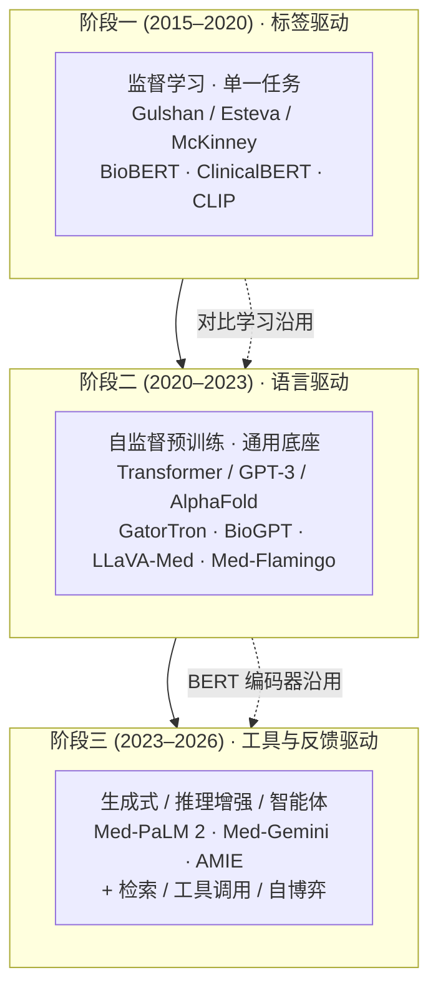
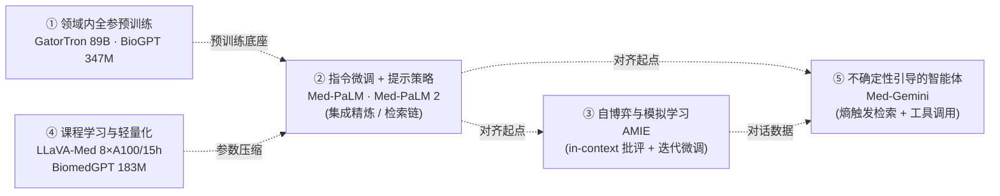
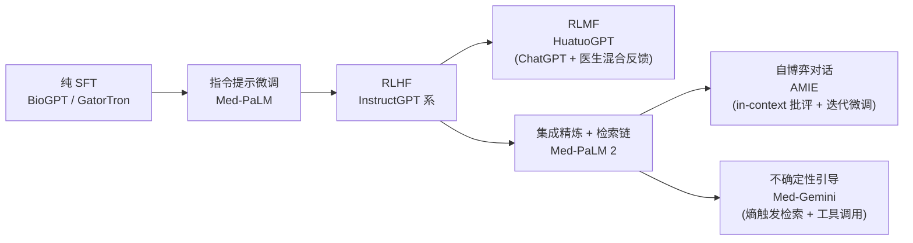
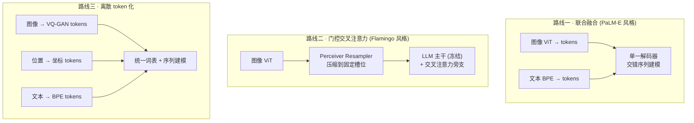
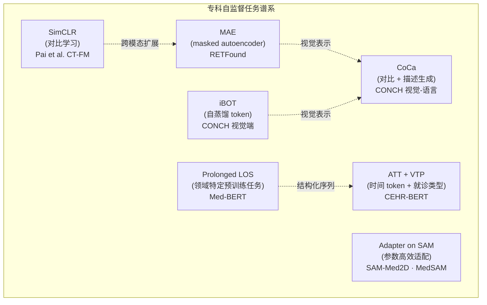

# 医疗人工智能与医疗大模型研究综述（2022–2026）· v6

> **撰写日期**：2026-05-13
> **文献范围**：纳入 2026-04-30 以前公开发表或可信预印本
> **检索口径**：以 *Nature / Nature Medicine / NEJM AI / Nature Communications / npj Digital Medicine / The BMJ / JAMA Network* 以及 NeurIPS / NAACL / EMNLP 等顶会顶刊为主，辅以方向性技术报告（Med-Gemini、Med-PaLM、LLaVA-Med、Foresight 2 等）
> **版本差异（v4→v6）**：v6 为语言润色版本，未改动内容与逻辑关系，仅优化中文表达流畅度与学术语感。v4 相对于 v3 的结构调整——将原 §6"深度思考"压缩为一节简短"讨论"，§7 结论相应收束——全部保留。

---

## 摘要

过去四年，医疗人工智能在三个层面经历了深刻变革：训练范式从任务专用监督学习走向通用基础模型，输出形式从判别式判断走向生成式交互，模态范围从单模态走向多模态融合。以 GPT-4、PaLM 2、Gemini 与 LLaMA 系列为代表的大语言与多模态模型，将医学问答、影像报告生成、临床决策支持与患者沟通统一纳入生成式框架，并不断刷新 USMLE、MultiMedQA、MultiMedBench、MedHELM 等基准的纪录。本综述以发展图景为主线，沿范式演进、医疗大语言模型、多模态医疗大模型与专科基础模型四条线索，梳理当下医疗 AI 的能力底色（§2–§5）；在此基础上，以一节简短讨论（§6）提示临床证据、评估方法与治理框架三方面目前仍未得到解决的若干具体问题，最后以结论（§7）收束。综述的核心判断是：医疗 AI 的能力扩张由数据规模、训练目标与结构先验三者共同驱动，通用化与专科化是互补关系而非进化的前后阶段；当前阶段最值得记录的，不是哪一种范式胜出，而是多代方法学在同一技术堆栈中的层级化叠加——这一叠加既是医疗 AI 当下能力的来源，也是后续讨论可信、可部署、可监管路径的起点。

---

## 1 引言

医疗人工智能在过去四年经历了一段近乎压缩式的快速演进。以 ChatGPT 公开发布为起点，不到三十六个月内，专门面向医学问答的 Med-PaLM 将美国执业医师考试题集 MedQA 的准确率由 67.6% 提升到 86.5%[^8][^13]，Med-Gemini 进一步提升到 91.1%，在评测题经重新标注修正歧义后甚至达到 91.8–92.9%[^7]。同期，多模态医疗大模型从最初仅接入图像，演化为同时处理视觉、语言、表格与基因数据：AMIE 在 OSCE 风格的诊断对话中，于 30/32 个专家维度上显著优于全科医生[^17]；PreA 在两家三甲医院 2,069 名患者的 RCT 中，将问诊时长降低近三成、跨科室协调度提升超过一倍[^20]。

本综述要回答的核心问题是：医疗 AI 的发展图景究竟呈现怎样的形状？围绕这一问题，本综述以发展图景为主线，分七章顺次推进：第 2 章梳理 2015–2026 年医疗 AI 在训练目标、模型规模、模态广度三条主轴上的演进；第 3 章对比英文与中文医疗大语言模型的能力图景及其评估的同步演进；第 4 章描绘多模态医疗大模型的架构谱系与数据-评估失衡；第 5 章论证专科基础模型在结构化电子健康记录（EHR）时序、影像、组学等任务上仍占据不可替代的位置——这四章共同构成发展图景的主体。第 6 章以一节简短讨论，提示临床证据、评估方法与治理框架三方面目前仍未得到解决的若干问题；第 7 章收束综述者的整体判断。

**图 1.1 综述总体结构（v4）**

> 图 1.1 注：§2–§5 描绘发展图景，对应研究问题 Q1–Q3；§6 以讨论形式提示几类尚未解决的结构性问题，不再展开为独立框架；§7 收束综述者立场。

具体而言，本综述围绕以下四个研究问题展开：

- **Q1（技术演进）**：医疗 AI 在 2015–2026 年的范式跃迁经历了哪些关键阶段？其底层动力是什么？
- **Q2（能力图景）**：医疗大语言模型与多模态大模型当下达到了怎样的能力上限？英文与中文两条路线呈现何种互补结构？
- **Q3（专科 vs 通用）**：在哪些子领域，专科基础模型仍系统性优于通用大模型？通用化在何种意义上是有代价的？
- **Q4（尚未解决的问题）**：在能力维度之外，临床证据、评估方法与治理框架三方面目前还呈现哪些可观察的具体问题？

在术语口径上，本综述将医疗大语言模型（Medical LLM）界定为：以自然语言为主输入输出、参数规模在十亿量级以上、并在医学语料上做过领域适配（继续预训练、指令微调或强化学习）的语言模型；将多模态医疗大模型（Medical LMM / VLM）界定为：除文本外，还能接受影像、生物信号、结构化 EHR、组学等至少一种模态作为输入的大模型；将专科基础模型界定为：在单一医学子领域（如眼底、病理、CT、EHR 时序）上经自监督预训练、并能在该子领域多类下游任务上展现迁移能力的模型。医疗 AI 作为更广义的伞形术语，涵盖上述三类以及传统任务专用监督模型。基准成绩在本综述中专指静态问答或分类基准上的指标（如 MedQA 准确率），与之相对的是临床效用——即在真实临床工作流中，以临床终点（如再入院率、误诊率、问诊时长）度量的指标。

---

## 2 范式演进回顾：从任务专用监督到生成式智能体

医疗 AI 在 2015–2026 年的演进可划分为三个相互衔接、而非简单替代的阶段（图 2.1）。其背后动力是训练目标的两次跃迁——先由标签驱动进入语言驱动，再由语言驱动进入工具与反馈驱动——每一次跃迁都为模型解锁了不同的能力边界，但前一阶段的方法学并未随之退场，而是作为模块被纳入新阶段继续发挥作用。这一观察是后续讨论通用与专科互补的方法论起点。

**图 2.1 三阶段训练目标演化**

> 图 2.1 注：三阶段并非简单替代，虚线表示前阶段方法学在后阶段中作为模块沿用——对比学习成为阶段二多模态对齐组件，BERT 风格双向编码器在阶段三中作为检索召回端或专科编码器继续发挥作用。这一沿用关系是 §5 论证专科基础模型不可替代位置的方法学基础。

### 2.1 阶段一:任务专用监督学习(约 2015–2020)

这一阶段主要依靠高质量标注数据，以 CNN 与 RNN 做端到端监督训练。Gulshan 等以 12.8 万张视网膜图像训练 InceptionV3，在糖尿病视网膜病变筛查上达到与眼科医师相当的灵敏度与特异性；Esteva 等以 12.9 万张皮肤镜图像训练 GoogLeNet，完成 2,032 种皮肤病变的细粒度分类；McKinney 等以英国与美国两国筛查数据训练乳腺癌检测模型，在前瞻验证中减少假阳性 5.7%、假阴性 9.4%[^3]。截至本综述撰写时，美国 FDA 已批准超过 500 项 AI/ML 医疗器械软件（SaMD），其中绝大多数仍属于这一阶段方法学的产物——单一模态、单一任务、强监督依赖，训练数据规模在十万至百万量级[^3]。

值得注意的是，尽管后续范式很快推陈出新，这一阶段并未随之消散，反而在方法学层面留下了若干延续至今的线索。**对比学习**自 CLIP、ConVIRT 起逐渐取代纯监督，将影像-报告对作为弱监督信号使用，直接孕育出阶段二的多模态对齐组件；BioBERT、ClinicalBERT 将 **BERT 风格的双向编码器**适配到医学文本，成为 GatorTron、Med-BERT 等后续模型的技术基线[^9]；以**固定测试集上报告 AUC** 为核心的回顾性验证范式也在这一时期被确立，沿用至今仍是绝大多数医疗 AI 论文默认的评测协议。

### 2.2 阶段二：基础模型与多模态融合（2020–2023）

研究重心在这一时期从单一任务的端到端训练，转向先以自监督预训练打造通用底座、再向具体任务迁移。支撑这一转向的，是 Transformer、AlphaFold、CLIP、GPT-3 四块基础设施：Transformer 将序列建模统一为一种可扩展至跨模态的通用架构；AlphaFold 证明了大规模自监督在生物分子结构上的强迁移能力；CLIP 将图像与文本的对比学习推升为一种可扩展的视觉表示学习目标；GPT-3 则首次展示出，不更新权重也能通过提示完成跨任务推理的零样本和少样本能力[^4]。

在此基础上，Acosta 等于 2022 年提出"多模态生物医学 AI"（Multimodal Biomedical AI）概念框架，将精准组学健康、数字化临床试验、远程监护、大流行病监测、数字孪生与虚拟健康助手六类应用纳入统一视角[^5]；Moor 等于 2023 年在 *Nature* 提出"通用医疗 AI"（Generalist Medical AI, GMAI）框架，将通用医疗模型的三大核心能力概括为动态任务指定、灵活多模态输入输出与医学领域知识表示[^6]。GMAI 与多模态生物医学 AI 共同确立了阶段二的目标函数——不再追求在某一项任务上达到医生水平，而是追求在尽可能广的任务谱系上，以同一组权重保持可用。

代表性体系也集中出现在这一阶段。语言侧，GatorTron 以 820 亿临床笔记词、60 亿 PubMed 词、25 亿 Wiki 词从头训练到 89B 参数，在临床推理任务上比 BioBERT 提升约 9.5–9.6%[^9]；BioGPT 在 1500 万 PubMed 摘要上从头训练 GPT-2 Medium，PubMedQA 准确率达到 78.2%[^10]。多模态侧，LLaVA-Med 通过 600K 图文对齐加 60K 自指令对话的两阶段课程，仅用 8 张 A100、不足 15 小时即完成训练，在生物医学视觉问答任务上达到与远大于自身的模型相当的性能[^11]；Med-Flamingo 以 OpenFlamingo + LLaMA-7B 为骨架，从 4,721 本医学教科书抽取构建 MTB 数据集（80 万图、5.84 亿 tokens），首次在医学多模态领域验证了少样本上下文学习（ICL）的可行性[^12]。

### 2.3 阶段三：生成式 AI 与智能体（2023–2026）

ChatGPT 在 2022 年末引爆公众关注之后，医疗 AI 的方法学焦点迅速从单纯的基础模型，转移到生成式接口、工具调用与推理增强的组合上。Med-PaLM 系列是这一阶段的开局之作：Singhal 等在 540B Flan-PaLM 上仅通过指令提示微调（更新约 65 个软提示参数），就将科学共识一致率从 61.9% 提升到 92.6%，接近临床医生的 92.9%[^8]；其后的 Med-PaLM 2 在 PaLM 2 基础上引入集成精炼（Ensemble Refinement）与检索链（Chain of Retrieval）两项推理增强机制，MedQA 准确率达到 86.5%，并在 9 个临床轴中的 8 个上获得医生评审者偏好[^13]。

Med-Gemini 进一步将方法学边界推到基于不确定性的自主搜索——当模型输出 token 的 Shannon 熵超过阈值时自动触发网络检索，将外部知识接地纳入推理回路；同时利用 Gemini 1.5 的 1M+ token 上下文窗口，使模型可以直接解析完整电子病历或手术视频，无需 RAG 切片[^7][^16]。AMIE 则将自博弈与模拟学习作为方法学创新点：在 PaLM 2 基础上，内循环通过 in-context 批评反馈优化对话，外循环通过迭代微调更新权重，模拟覆盖 5,230 种疾病的多轮问诊场景，最终在 159 例 OSCE 风格双盲交叉研究中，以 30/32 个专家维度与 25/26 个患者维度显著优于 20 名全科医生[^17]。

值得注意的是，阶段三的几条主要技术路径并非彼此独立，而是在同一时期相互渗透。一方面，推理增强（如 DeepSeek-R1 与 OpenAI o-series 的链式思维与测试时计算）开始进入医疗领域，与传统的指令微调形成互补；另一方面，工具调用与智能体协议（function calling、Computer Use 等）推动模型从纯权重模型转向带工具的智能体。O'Sullivan 等 2026 年发表的心脏专科 AMIE 即是这一范式的具体落地——以 Gemini 2.0 Flash 为底座、配套领域工具与多步推理，仅在 9 例真实病例上做开发即完成 107 例 HCM 与心肌病的随机交叉部署，显著错误率较单纯专家组下降近一半[^19]。Teo 等在 *Nature Medicine* 2025 年的综述中，将这一阶段的方法学谱系总结为：合成数据系统（VAE/GAN）→ 扩散模型 → 规则型 AI → LLM → 多模态基础模型 → 推理与智能体 → 模型蒸馏，说明阶段三的核心特征不是任何单一技术，而是**多种生成式方法在同一医疗任务上的并置与组合**[^7]。

### 2.4 训练范式的横向剖面

把上述三阶段在训练范式上做横向切片，可以辨识出五种相互交叠、并在阶段三同时被广泛使用的训练范式（图 2.2）。

**图 2.2 五种训练范式的张量空间**

> 图 2.2 注：五种训练范式在张量空间中并非互斥而是正交切片——同一模型常同时占据多个范式位置。例如 AMIE 在自博弈之外也使用指令微调与不确定性表征；Med-Gemini 在不确定性引导之外也复用了 Med-PaLM 2 的检索链思想。虚线表示范式之间常见的复用与衔接路径。

最贴近传统路径的是**领域内全参数预训练**——GatorTron[^9] 与 BioGPT[^10] 都从零或接近零开始在领域语料上学习参数，分布契合度最高，但代价是极高的计算成本，且难以自然延展到多模态。与之相反，**指令微调与提示策略**将投入压在对齐而非重新预训练上：以 Med-PaLM 系列[^8][^13] 为代表，仅在大型通用基础模型之上用少量医学示例完成指令对齐，必要时配合集成精炼、检索链等组合手段；这条路在阶段三里性价比最高，也被复用得最广。**自博弈与模拟学习**切入的是数据来源问题——AMIE[^17] 让模型自身轮流扮演批评者与患者，构造大规模合成对话，绕开真实医患对话在隐私与规模上的双重约束。**课程学习与轻量化**关心的则是另一端：LLaVA-Med[^11] 与 BiomedGPT[^15] 借助阶段式课程与离散 token 化，将训练成本压回学术资源可承受的范围——前者 8 卡 15 小时即可完成训练，后者仅 183M 参数即在 25 项任务中 16 项达到 SOTA。**不确定性引导的智能体**出现得最晚，由 Med-Gemini[^7] 将推理时计算与外部工具调用纳入训练目标，使模型在低置信度时主动检索，而非过度自信地生成。

这几条路线之间并不彼此排斥。AMIE 在自博弈之外也使用了指令微调与不确定性表征；Med-Gemini 在不确定性引导之外也复用了 Med-PaLM 2 的检索链思想。综述者认为，对医疗 AI 训练范式更恰当的理解，是将它们视为同一张量空间中的不同正交切片，而非哪一种范式胜出的零和竞争。

### 2.5 技术里程碑时间表

表 2.1 给出 2017 年至 2026 年医疗 AI 关键里程碑的时间表，纵向阅读对应三阶段的演进，横向阅读对应训练范式的多样化。

**表 2.1 医疗 AI 关键里程碑（2017–2026）**

| 时间 | 里程碑 | 所属阶段 | 主要贡献 / 意义 |
|---|---|---|---|
| 2017 | Transformer[^A] | 阶段二基础设施 | 跨模态统一架构基础 |
| 2018–2019 | BERT / BioBERT / ClinicalBERT[^A] | 阶段一→二 | 生物医学双向编码器，迁移学习起点 |
| 2020 | GPT-3 / CLIP / AlphaFold[^4][^A] | 阶段二基础设施 | LLM / 视觉对比 / 蛋白结构三大基石 |
| 2021 | Med-BERT[^30] / CEHR-BERT[^31] | 阶段一→二 | 结构化 EHR 预训练，奠定专科基础模型路线 |
| 2022 | GatorTron[^9] / BioGPT[^10] / Multimodal Biomedical AI[^5] | 阶段二 | 域内规模定律首次验证；多模态综述框架 |
| 2022 | ChatGPT[^A] | 阶段二→三 | 引爆生成式医疗 AI 范式 |
| 2023 | GMAI[^6] / Med-PaLM[^8] / LLaVA-Med[^11] / Med-Flamingo[^12] / RETFound[^32] | 阶段三起点 | 通用医疗 AI 框架、医学 LLM 与多模态 VLM 并行突破；首个眼科自监督基础模型 |
| 2023 | HuatuoGPT[^33] / BianQue[^34] / DISC-MedLLM[^35] / SAM-Med2D[^36] | 阶段三 | 中文医疗 LLM 路线启航；分割基础模型扩展至 10 模态 |
| 2024 | Med-PaLM 2[^13] / Med-Gemini[^7][^16] / BiomedGPT[^15] / MAIRA-2[^24] / CONCH[^37] / CT-FM (Pai)[^38] / MedSAM[^39] / EquityMedQA[^40] | 阶段三 | 多模态 + 长上下文 + 不确定性引导；专科基础模型扩展至病理 / CT；首个医疗 LLM 公平性工具箱 |
| 2024 | Foresight 2[^41] / AMIE[^17] | 阶段三 | EHR 时序专科 LLM；自博弈对话诊断 |
| 2025 | MetaMedQA[^2] / MedHELM[^18] / FUTURE-AI[^42] | 阶段三评估转向 | 元认知评估、整体性评估、国际可信 AI 共识 |
| 2026 | 心脏专科 AMIE[^19] / PreA RCT[^20] / 心理治疗认知层[^21] / Bean RCT[^26] | 阶段三临床证据 | 真实临床 RCT 集中涌现 |

[^A]: 时间线背景节点引自 Acosta 等[^5]、Moor 等[^6]、Thirunavukarasu 等[^22]、Teo 等[^7]的综述以及通用 AI 文献基础。

### 2.6 章节小结

三阶段的演进并不是一条专科被通用替代的单向链条。阶段一的对比学习经 CLIP / ConVIRT 演化，成为阶段二多模态对齐的主流组件；阶段二的 BERT 风格双向编码器在阶段三中以检索召回端或专科编码器的形式继续发挥作用，Med-BERT、CEHR-BERT、RETFound、CONCH 等专科基础模型就是这一脉络在 2021–2024 年的延续；阶段一的回顾性验证范式则至今仍作为绝大多数医疗 AI 论文的评测协议在使用。将医疗 AI 的演进描述为一次替代式跃迁是一种误读——更准确的描述是**多代方法学在同一技术堆栈中的层级化叠加**。这一观察直接为 §5 关于专科基础模型不可替代位置的论证铺路。

---

## 3 医疗大语言模型的能力图景

医疗大语言模型在过去三年完成了一次重要过渡：从通用底座加领域微调的单纯组合，演进为通用底座、推理时计算与工具调用三者的混合。在这一过渡中，主流体系并未沿单一技术路径展开，而是分化为三条相互渗透的能力路线——**指令微调与提示策略、不确定性与推理增强、自博弈与模拟学习**。英文主导的体系（Med-PaLM 家族、Med-Gemini、AMIE）在 USMLE 风格的静态基准上已接近性能上限；中文主导的体系（HuatuoGPT、BianQue、PULSE、DISC-MedLLM）则将完成一次合规的多轮问诊作为产品形态，在主动追问、共情表达与本地诊疗指南覆盖上发展出与英文路线明显不同的方法学侧重。两条路径并非互相竞争，而是共同构成当下医疗 LLM 的完整能力图景。

### 3.1 路线一：指令微调与提示策略

这条路线的核心理念是将大量医学领域适配工作放在对齐而非重新预训练上，从而最大化通用基础模型的语言能力红利。其代表性序列由 Med-PaLM[^8] 与 Med-PaLM 2[^13] 构成。Singhal 等在 540B Flan-PaLM 之上仅通过指令提示微调更新约 65 个软提示参数，就将模型在 MedQA（USMLE）上的准确率由 50.3% 提升到 67.6%，并将科学共识一致率由 61.9% 推高到 92.6%，接近临床医生的 92.9%[^8]。同期由 Med-PaLM 团队构建的 **MultiMedQA** 评估集整合 MedQA、MedMCQA、PubMedQA、MMLU 临床子集、LiveQA、MedicationQA 与 HealthSearchQA 共计 3,173 题，成为这一阶段事实上的标准基准；同时配套引入科学共识一致性、不当内容、遗漏、危害程度与偏见五个维度的临床医生人工评估框架。

Med-PaLM 2 在 PaLM 2 基础上叠加两项关键推理增强：**集成精炼（Ensemble Refinement）**通过多路并行推理后综合输出，降低单一采样的偶然性；**检索链（Chain of Retrieval）**将初始答案拆分为若干可验证子声明，逐项调用搜索完成事实接地。这两项机制使其在 MedQA 上达到 86.5%，并在 9 个临床轴中的 8 个上获得医生评审者偏好（均 P<0.001）[^13]。值得注意的是，Med-PaLM 2 的评估范式较 Med-PaLM 进一步升级——从单边评分演化为**配对排名**——这一升级直接催生了 MedHELM 等后续评估架构[^18]。

### 3.2 路线二：不确定性引导与推理增强

当指令微调将静态准确率推近基准上限后，模型的剩余错误主要表现为**过度自信的事实捏造**——在低置信度区间仍以高置信度生成内容。Med-Gemini 系列以此为切入点，将训练目标从单纯提升正确率转向让模型在不确定时主动检索[^7]。其核心机制是基于输出 token 的 Shannon 熵触发外部搜索：当模型对下一 token 的预测分布过于平坦时，自动调用网络检索，将外部知识接地纳入推理回路。Med-Gemini 在 MedQA（USMLE）上取得 91.1% 的准确率；更具方法论意义的是，Med-Gemini 团队对评测题重新标注（修复原题中的错答与歧义）后，SOTA 准确率移动到 91.8–92.9%——这一观察直接说明**评测瓶颈已从模型能力转移到标注质量**，是阶段三评估范式转向的一个早期信号。

Med-Gemini 的另一项关键设计是利用 Gemini 1.5 的 1M+ token 上下文窗口直接解析完整电子病历或手术视频，将检索增强生成（RAG）中的切片、召回与拼接步骤大幅简化为直接的上下文嵌入[^7]。这一设计在概念上将"模型 + RAG"的两段式架构压缩为"模型、上下文与工具调用"的三层架构，是从语言驱动过渡到工具与反馈驱动的具体落地范例。其 2D / 3D / Polygenic 扩展[^16] 则展示了这一架构在多模态长尾任务上的延展能力，将在 §4 进一步讨论。

### 3.3 路线三：自博弈与模拟学习

第三条路线以 Tu 等提出的 AMIE 为代表[^17]。AMIE 的方法学创新在于用自博弈绕开真实医患对话数据在隐私与规模上的约束：在 PaLM 2 基础上，模型同时扮演医生与模拟患者两个角色，内循环通过 in-context 批评机制对每一轮对话即时反馈，外循环将累积的高质量对话作为新的微调数据迭代更新权重，模拟覆盖 5,230 种疾病的多轮问诊场景。在 159 例 OSCE 风格双盲交叉研究中，AMIE 以 30/32 个专家维度与 25/26 个患者维度显著优于 20 名全科医生（GP）；在鉴别诊断推理和管理建议合理性两个维度上，AMIE 的优势超过 0.5 个李克特量级。

AMIE 的方法学价值不止于"模型超过医生"这一论断——更重要的是它将**模拟学习的合规边界**纳入了主流方法学的讨论：与依赖真实医患对话训练的中文路线相比，自博弈能在不接触患者隐私的前提下生成功能近似的训练信号，但代价是模拟分布与真实分布之间的潜在偏差。

### 3.4 中文医疗大语言模型：另一种问题设定

英文体系以通过 USMLE 或增益医生工作流为里程碑，因而长于应答能力；中文体系则以完成一次合规的多轮问诊为产品形态，因而长于主动追问能力。这一差异不仅是评估目标的差异，更是**问题设定**的差异，并由此孕育出方法学层面的独立创新。

HuatuoGPT 是这一路线的代表性早期工作[^33]。Zhang 等观察到，当时医疗 LLM 要么纯粹蒸馏自 ChatGPT（导致模型崩溃、缺乏专业诊断能力），要么只在真实医患对话上训练（回复简短、不够友好），两类数据各有优劣但互补。他们提出混合数据 SFT 加混合反馈强化学习（RLMF）的双重融合架构：前者同时利用 ChatGPT 蒸馏数据（带来指令跟随与流畅表达）与真实医患对话数据（带来专业诊断与主动追问），后者由 ChatGPT 与人类医生联合提供奖励信号。HuatuoGPT 基于 LLaMA-13B（Ziya-LLaMA 预训练初始化）训练，在多轮对话评估中对 DoctorGLM 胜率 97%、对 ChatGPT 胜率 62%；在 cMedQA2、webMedQA、Huatuo-26M 三个中文医疗 QA 基准上，BLEU、ROUGE 等指标排名第一，在 cMedQA2 上甚至超越微调后的 T5。

BianQue 进一步将主动追问明确为一种独立能力，提出**Chain of Questioning（CoQ）**概念[^34]。Chen 等指出，真实临床场景中医生需通过多轮问诊逐步了解患者状况才能给出个性化建议；当时的中文医疗 LLM 因训练数据缺乏多轮追问样本，只会建议、不会提问。BianQue 团队构建了 243 万条多轮健康对话数据集 BianQueCorpus，通过 ChatGPT 对真实医患对话中医生的建议做润色，保持问题与建议的比例约为 46.2% 比 53.8%；以 ChatGLM-6B 为底座做全参数微调后，BianQue 在 MedDG 数据集上 BLEU-1 达到 14.86（ChatGPT 为 5.11）、ROUGE-L 达到 19.56（ChatGPT 为 5.46）、自定义的 PQA（Proactive Questioning Ability）指标达到 0.81（ChatGPT 为 0.63）。

PULSE 与 DISC-MedLLM 进一步将中文路线扩展到更大规模与更系统的偏好对齐。PULSE 由上海人工智能实验室 OpenMEDLab 团队发布，以 BLOOMZ-7B 与自研中文基座扩展版本为底座，在约 400 万条中文医学指令数据（涵盖医学问答、医患对话、医学知识图谱问答、医考真题、电子病历摘要等）上做监督微调，在中国国家医师资格考试题库 MedQA-MCMLE 与中文综合医学基准 CMB 上压制同期开源中文通用 LLM[^43]。DISC-MedLLM 由复旦大学团队基于 Baichuan-13B-Base 构建，其 DISC-Med-SFT 数据集通过三条管线生成约 47 万条样本——真实医患对话改写、医学知识图谱 CMeKG 三元组转 QA、以及人类偏好对齐数据；其多轮一致性与行为得分超过 HuatuoGPT、BianQue 与中文 GPT-3.5[^35]。

中文路线的评估生态也在同步成熟。Wang 等于 NAACL 2024 主会发表的 **CMB** 覆盖六大临床工种、中医、药剂、护理等子领域，并按照中国医师资格考试结构设计层级化任务[^44]；其后的 CMExam（约 6 万题、五维结构化知识点）与 MedBench（上海 AI 实验室）进一步加入了临床安全维度。值得指出的是，CMB 与 MedBench 中包含中医与医保政策等本地化任务，使中文医疗基准与 MultiMedQA、MedHELM 形成了非平凡的结构性差异。

### 3.5 早期 NLP 基础与评估同步演进

需要补充说明的是，阶段三的医疗 LLM 并非凭空出现，其方法学血脉直接承接阶段二的两个里程碑——GatorTron 与 BioGPT。Yang 等[^9]训练的 GatorTron 首次将领域内全参预训练的规模法则验证到 89B 参数级，在 NLI、临床问答等任务上相对 BioBERT 提升约 9.5–9.6%；Luo 等[^10]训练的 BioGPT 首次将生成式预训练应用于生物医学文本（1500 万 PubMed 摘要），PubMedQA 准确率达 78.2%。这两项工作在不同程度上构成了后续 Med-PaLM 系列、HuatuoGPT、Foresight 2 等模型的方法学先驱。

评估范式的演进与上述能力扩张同步发生：从 Med-PaLM 时代的 MultiMedQA[^8]（五维医生人工评估加多任务静态准确率），到 Med-PaLM 2 时代的配对排名[^13]（9 个临床轴、与医生或真实回答对照），再到 MedHELM[^18]（5 大类 22 子类 121 任务）——评估方法学的每一次升级，都直接回应了模型能力的某一具体扩张。这种**模型-评估协同演进**，是医疗 LLM 之所以能在三年内连续刷新基准的方法学原因。

### 3.6 章节小结

表 3.1 将上述四条路线的代表性模型并置对比，可以看到同一阶段内的方法学多样性远大于阶段之间的方法学差异——AMIE 与 Med-PaLM 2 的差距小于 Med-PaLM 2 与 GatorTron 的差距，DISC-MedLLM 与 HuatuoGPT 的方法学距离也明显小于二者与 BiomedGPT（§4 详述）的方法学距离。这一观察提示：**当下医疗 LLM 的能力上限不再由底座大小单独决定，而是由训练目标、对齐数据与推理时计算三个因素共同决定**。

中英文路线的并行存在则给出一条更重要的方法学线索：**目标场景的差异比技术代差更能解释模型行为的差异**。当英文社区以通过 USMLE 或增益医生工作流为里程碑时，方法学投资集中在静态问答与文档生成；当中文社区以完成合规多轮问诊为产品形态时，方法学投资集中在主动追问、共情表达与本地诊疗指南覆盖。CoQ、RLMF 等概念正是这种问题设定差异所孕育的独立创新。

**表 3.1 代表性医疗大语言模型横向对比**

| 模型 | 年份 | 主干 | 训练 / 对齐数据 | 关键贡献 | 代表性结果 | 目标场景 |
|---|---|---|---|---|---|---|
| BioGPT[^10] | 2022 | GPT-2 Medium 347M | 1500 万 PubMed 摘要 | 首个生物医学生成式 PT | PubMedQA 78.2% | 文献问答 |
| GatorTron[^9] | 2022 | Megatron-LM BERT | 820 亿临床笔记词 | 89B 临床域内全参预训练 | NLI 90.20% / MQA 93.10% | 临床 NLP |
| Med-PaLM[^8] | 2023 | Flan-PaLM 540B | 指令提示微调 (~65 软提示) | 多维医生评估 + MultiMedQA | MedQA 67.6% / 危害比例 5.9% ≈ 医生 5.7% | USMLE 风格问答 |
| Med-PaLM 2[^13] | 2025 | PaLM 2 | MedQA / MedMCQA / HSQA | ER + Chain of Retrieval | MedQA 86.5% / 9 轴 8 轴胜医生 | 工作流问答 |
| Med-Gemini[^7] | 2024 | Gemini 1.0 Ultra | 多模态混合 + 自训练 | 不确定性引导搜索 + 1M token | MedQA 91.1% / 重标后 91.8–92.9% | 长上下文 + 工具调用 |
| AMIE[^17] | 2025 | PaLM 2 | 真实对话 + 自博弈 | in-context 批评 + 迭代微调 | OSCE 30/32 专科维度优于 GP | 多轮诊断对话 |
| **HuatuoGPT**[^33] | 2023 | LLaMA-13B (Ziya) | Huatuo-26M + Med-Dialog + ChatGPT 蒸馏 | 混合数据 SFT + RLMF | vs DoctorGLM 胜率 97% / vs ChatGPT 62% | 中文多轮咨询 |
| **BianQue**[^34] | 2023 | ChatGLM-6B | BianQueCorpus 243 万 | Chain of Questioning (CoQ) | MedDG PQA 0.81 vs ChatGPT 0.63 | 主动追问问诊 |
| **PULSE**[^43] | 2023 | BLOOMZ-7B + 自研 20B | ~400 万中文医学指令 | 中文医考 + 中医 + 指南 | CMB / MedQA-MCMLE 领先开源中文通用 LLM | 中文医考与咨询 |
| **DISC-MedLLM**[^35] | 2023 | Baichuan-13B | DISC-Med-SFT 47 万 | 三管线数据 + 偏好对齐 | 多轮一致性优于 HuatuoGPT / BianQue / 中文 GPT-3.5 | 中文医疗对话 |

**图 3.1 训练目标演化（SFT → RLHF → RLMF → 自博弈 → 不确定性引导）**

> 图 3.1 注：图示展示了从纯监督微调到推理时计算的训练目标演化谱系，并非严格的时间顺序，而是依赖关系。RLMF（HuatuoGPT）与 RLHF 平行而非串行；Med-PaLM 2 的检索链是 Med-Gemini 不确定性引导的方法学前身；AMIE 的自博弈机制则与不确定性引导共享推理时反馈这一元思路。

---

## 4 多模态医疗大模型

多模态医疗大模型的演进围绕同一目标展开：如何将视觉、生物信号、组学等模态稳健地接入语言模型，并在下游任务上保持统一权重的可用性。目前，架构层面的争论已基本收敛——三条主流融合路线在 MultiMedBench 等综合基准上的性能差距已小于 5 个百分点——竞争焦点随之转移到三类不对称上：模态可得性不对称、评估指标不对称与空间接地不对称。本节先梳理三条架构路线的方法学要点，再以 MAIRA-2 的 RadFact 评估为案例说明评估指标的转向，最后给出综述者对未来 24 个月最具回报率工作的判断。

### 4.1 架构路线一：联合融合（PaLM-E 风格的 token 交错）

联合融合将视觉编码器输出的 token 与文本 token 直接拼接，再由单一解码器在交错序列上完成跨模态推理，是三条路线中策略最为直接的一种。Tu 等的 Med-PaLM M[^14] 是这条路在医疗领域最具代表性的落地：以 PaLM-E 为骨架，将 12B、84B、562B 三档参数规模分别在 MultiMedBench 的 14 个任务上做统一权重训练，覆盖 MedQA、MedMCQA、PubMedQA、MIMIC-III RRS（放射报告摘要）、VQA-RAD、Slake-VQA、Path-VQA、MIMIC-CXR、PAD-UFES-20、VinDr-Mammo、CBIS-DDSM、PrecisionFDA V2 等基准；其 562B 版本在 14 个任务中全部达到或接近 SOTA，是当时通用医疗多模态模型的能力上限。Med-PaLM M 的方法学贡献不在架构创新，而在 MultiMedBench 数据集本身——超过 100 万样本的多模态医疗任务集合，至今仍是该领域覆盖最广的统一评估基准。

### 4.2 架构路线二：门控交叉注意力（Flamingo 风格的视觉旁支）

门控交叉注意力先以 Perceiver Resampler 将视觉特征压缩到固定槽位，再以门控交叉注意力将视觉信息注入 LLM 的中间层，从而在引入视觉模态的同时尽量保留 LLM 主干的原有能力。Moor 等的 Med-Flamingo[^12] 将这一思路引入医学领域：以 OpenFlamingo + LLaMA-7B 为骨架（共 8.3B 参数），从 4,721 本医学教科书抽取构建 MTB（Medical Textbook Benchmark）数据集（80 万图、5.84 亿 tokens）用于继续训练。Med-Flamingo 的方法学贡献在于首次在医学多模态领域验证了**少样本上下文学习（ICL）**的可行性：模型可在 4–8 个标注样本的提示下，完成 PathVQA、VQA-RAD 等任务的零样本到少样本推理。其局限在于 PathVQA 等病理任务上表现仍弱（受 LLaMA-7B 体量限制），且作为概念验证（PoC）未在临床场景落地。

### 4.3 架构路线三：离散 token 化与统一序列建模

离散 token 化将图像、文本、表格乃至空间位置统一映射为离散 token，再由 Transformer 在共享词表上完成序列建模，将跨模态统一性推进到更彻底的形式。Zhang 等的 BiomedGPT[^15] 是这条路的轻量化代表：以 OFA 框架为基础，用 VQ-GAN 将图像离散为视觉 token，与文本 BPE token 共享一个 59,457 维的统一词表；33M、93M、182M 三档参数规模在 25 项任务中 16 项达到 SOTA。值得强调的是，182M 参数版本相对 562B 的 Med-PaLM M 在参数规模上缩小超过 3,000 倍，却仍在多项放射、病理、皮肤镜任务上保持接近 SOTA 的性能——这一对比为综述者关于"模型规模不再是能力上限唯一决定因素"的判断提供了直接证据。

Bannur 等的 MAIRA-2[^24] 将离散 token 化进一步扩展到**空间坐标**：以 100×100 网格坐标 token 编码病灶的空间定位，使模型能够生成带句级 BBox 的接地放射报告（Grounded Radiology Report）。MAIRA-2 由 Vicuna + Rad-DINO 组合构建（约 7B 参数），在 MIMIC-CXR 上取得 BLEU-4 23.1、RadGraph-F1 34.6 等 SOTA 成绩，专家评审显示 91% 的句子可被临床医生直接接受。其方法学创新更重要的部分是配套提出的 **RadFact** 评估框架，下一节详述。

### 4.4 长上下文与模态扩展

除上述三条主流架构之外，Med-Gemini 系列以**长上下文窗口**为多模态扩展提供了另一种途径[^7][^16]。Med-Gemini-M 1.5 支持 1M+ token 上下文，意味着模型可以将完整的电子健康记录、长视频或多张影像直接嵌入提示，而不再依赖 RAG 切片。Med-Gemini-2D 接入了 X 光、皮肤镜、眼底等 2D 模态；Med-Gemini-3D 将头颈 CT、肺部 CT 等三维体素数据通过切片采样接入并完成报告生成；Med-Gemini-Polygenic 则将基因组多基因风险评分（PRS）以零样本方式纳入预测——这是将多模态从图像扩展到组学的一次方法学尝试。值得指出的是，Med-Gemini-3D 在结构化报告生成任务上仍存在显著幻觉，CT-US1 等私有数据集的使用也使其结论的可复核性受限。

### 4.5 接地与可追溯：RadFact 作为评估指标转向的案例

多模态医疗报告生成长期以 BLEU、ROUGE、CIDEr 等基于词汇重叠的指标作为评估标准。这些指标在通用图像描述任务上尚可，但在医学报告中存在一个根本缺陷——**它们对错误的临床显著性不敏感**：将"无气胸"误写为"有气胸"，与将"肺部清晰"换成"肺野清晰"，在 BLEU 上可能扣分相近，而临床后果却天差地别。MAIRA-2 配套的 RadFact[^24] 是第一个针对这一缺陷做系统响应的评估框架——它用 Llama-3-70B 对模型生成的报告与参考报告做句级逻辑蕴含推断，给出四维评估：*逻辑精确率与召回率*（每个生成句子是否被参考报告蕴含、是否能蕴含某句参考）与*空间精确率与召回率*（句级 BBox 与参考 BBox 的对应关系）。在 MIMIC-CXR 上，MAIRA-2 的 RadFact 逻辑精确率与召回率显著超出 BLEU 等传统指标的可分辨范围，并与放射科专家评分高度相关。RadFact 的方法学意义超出 MAIRA-2 本身——它代表了**从对齐指标到接地指标**的整体转向。

### 4.6 章节小结

将三条架构路线、长上下文扩展与接地评估并置（表 4.1、图 4.1），可以看到一个清晰图景：**多模态医疗大模型的瓶颈，已从"如何将视觉接入 LLM"转向"如何让有限的数据、评估与接地基础设施跟上模型能力"**。具体而言，这一瓶颈在三个维度上呈现不对称：CXR、皮肤镜、眼底等 2D 影像在 PMC-15M（1,500 万对图文）等公开数据中占主导，但病理、3D CT、心脏超声、内镜视频等模态长尾稀缺；BLEU 与 ROUGE 仍是大多数论文的默认指标，RadFact 这类临床显著性加权评估仅在少数体系中得到协议化；MAIRA-2 的句级 BBox 接地虽在 MIMIC-CXR 上达到 SOTA，但在其他模态、其他任务上，类似程度的接地仍属空白。基于这三个不对称，综述者的判断是：**未来 24 个月最具回报率的工作不在新架构**，而在三个具体方向：(i) 病理、3D CT、心脏超声等长尾模态的多机构数据联盟；(ii) 临床显著性加权评估协议的标准化；(iii) 跨模态空间接地的统一表示。

**表 4.1 代表性多模态医疗大模型横向对比**

| 模型 | 模态覆盖 | 规模 | 架构路线 | 突出贡献 | 关键局限 |
|---|---|---|---|---|---|
| LLaVA-Med[^11] | 文本 + 影像（CXR / CT / MRI / 病理） | 7B / 13B | 联合融合（视觉投影） | GPT-4 自指令 + 两阶段课程 / 8×A100 训练 <15h | 输入仅 224×224，幻觉显著 |
| Med-Flamingo[^12] | 文本 + 影像 | 8.3B | 门控交叉注意力 | MTB 80 万图、ICL 少样本 | PathVQA 弱，仅 PoC |
| Med-PaLM M[^14] | 文本 + CXR + 病理 + 皮肤 + 钼靶 + 基因组 | 12B / 84B / 562B | 联合融合（PaLM-E） | MultiMedBench 14 任务统一权重 | 未开源，缺前瞻验证 |
| BiomedGPT[^15] | 文本 + 2D 图像 + 表格 | 33M / 93M / 182M | 离散 token（VQ-GAN + 统一词表） | 全开源 + 轻量化（vs 562B 缩小 3,000+ 倍） | 零样本 VQA <60% |
| Med-Gemini-2D/3D/Polygenic[^16] | 2D 影像 + 3D CT + 基因组 | 未披露 | 长上下文 + 多模态 | 3D 报告生成、PRS 零样本 | 3D 幻觉，CT-US1 私有 |
| **MAIRA-2**[^24] | CXR + 历史片 + 临床文本 | ~7B (Vicuna + Rad-DINO) | 离散 token（空间坐标） | 句级 BBox 接地 + RadFact 评估 | 仅 CXR，51% 训练数据私有 |

**图 4.1 多模态融合的三条架构路线拓扑**

> 图 4.1 注：三条架构路线在 MultiMedBench 等综合基准上的性能差距已小于 5 个百分点，竞争焦点已转移到数据可得性、评估指标与空间接地三个不对称维度（见 §4.6）。MAIRA-2 选择路线三并叠加空间坐标 token；Med-Gemini 在路线二基础上叠加长上下文；Med-PaLM M 是路线一的旗舰；LLaVA-Med 与 BiomedGPT 分别是路线一与路线三的轻量化代表。

---

## 5 专科基础模型的不可替代位置

将 §2–§4 的讨论合在一起，很容易得出一个直觉式结论——既然通用基础模型不断刷新基准，那么专科监督学习时代"小而专"的路线是否已被淘汰？本节给出一个反向论证：**在结构化电子健康记录（EHR）时序、专科影像、组学预测等具备强结构先验的子领域，专科自监督基础模型在精度、样本效率与跨机构泛化三个维度上系统性优于通用多模态大模型；通用与专科不是进化的前后阶段，而是互补关系**。这一论断是 §2–§4 现状底色之后的最后一块拼图。

### 5.1 结构化 EHR 时序：从 Med-BERT 到 Foresight 2

医疗 AI 中最具结构先验的子领域是结构化 EHR——其本质是一组以患者为单位、按时间排序的 ICD、SNOMED、CPT 与药物编码序列。与自然语言相比，它具有三个结构特征：**编码空间离散且封闭、时间间隔关键、患者间方差远大于编码方差**。这些特征决定了直接套用通用 LLM 在 EHR 上很难取得最优表现，这一判断在过去五年已被三项标志性工作反复证实。

Rasmy 等的 Med-BERT[^30] 与 Pang 等的 CEHR-BERT[^31] 代表了结构先验工程化的两条早期路径。Med-BERT 在 Cerner Health Facts 的 2,849 万患者诊断码序列上预训练 17M 参数的 BERT 风格模型，关键创新是在 Masked LM 之外引入**延长住院时长预测**（Prolonged LOS）作为领域特定的第二预训练目标；在 300 个样本的小数据场景下，Med-BERT 接 Bi-GRU 仍可达 AUC 0.75，相当于训练集扩大约 10 倍后的 Bi-GRU 性能。CEHR-BERT 则将方法学焦点放在**时间结构**上——以**人工时间标记**（Artificial Time Tokens, ATT）将相邻就诊间隔以离散 token 形式插入序列，配合 time2vec 风格的概念-时间-年龄嵌入，并以**就诊类型预测**（VTP）替换 BERT 原版 NSP；基于哥伦比亚大学医学中心 240 万患者 OMOP 数据预训练后，仅用 5% 训练数据微调的 CEHR-BERT，仍能超越使用全量数据训练的所有对比模型。两项工作共同揭示了**样本效率随结构先验显著放大**的规律。

最具方法学冲击力的是 Kraljevic 等近期发表的 Foresight 2[^41]。其关键设计是**语境化患者时间线**——保留每个 SNOMED 概念被提及的原始文本上下文（含否定与修饰），并将 SNOMED 编码嵌入 LLM 分词器（以概念名称的 token 平均嵌入初始化），使 7B 规模的通用 LLM（Mistral-7B 与 LLaMAv2-7B）能够高效处理标准化医学本体的输入与输出。在 MIMIC-III 535 名患者的风险预测测试集上，Foresight 2 的 P@5（5 个预测中至少 1 个正确）达到 **0.90**，**显著高于 GPT-4-turbo 的 0.65**。这一对比直接说明：当 EHR 任务被恰当地结构化建模时，**7B 专科模型可以系统性压制远大于其规模的通用模型**。同样关键的是 Foresight 2 的上下文消融实验——移除患者时间线中的文本上下文（仅保留 SNOMED 概念序列）后，性能下降约 40%——这一数字定量地说明了结构先验与通用语言能力必须同时具备这一方法学结论。

### 5.2 影像与分割专科基础模型

专科影像领域的方法学创新沿三条线索展开：**视觉自监督表示学习、视觉-语言对齐、参数高效适配**。三条线索分别对应不同的下游任务结构与数据可得性约束，但都在小样本与长尾场景下展现出对通用模型的系统性优势。

视觉自监督一脉以 Zhou 等的 RETFound[^32] 为旗舰。其以 ViT-Large 在 90.4 万张彩色眼底照片（CFP）与 73.6 万张光学相干断层（OCT）图像上做 MAE 风格预训练，下游覆盖糖网分级、青光眼、AMD 等 8 项眼科诊断任务，以及心衰、心梗、缺血性卒中、帕金森病 4 项 3 年预后预测；全部 12 项任务的 AUROC 均优于 ImageNet 预训练与监督基线，**优势在每类样本少于 100 时最为显著**。RETFound 的方法学价值更在于，它论证了单一专科自监督底座可同时承载多种跨学科预测任务，为后续病理与 CT 专科底座直接铺路。Pai 等[^38] 将同一思路扩展到 3D CT，以 3D ResNet-50 在约 1.1 万例 CT（DeepLesion、LIDC、NLST 子集，超过 60 万 3D 体素 patch）上做 SimCLR 风格对比自监督，在跨机构外部验证集上 AUC 与 C-index 显著优于 ImageNet-3D 与从头训练基线，稳健性优势同样集中在标注稀少的预后任务上。

视觉-语言对齐一脉的代表是 Lu 等的 CONCH[^37]。其方法学包含两步：先以 1,600 万张病理 ROI 做 iBOT 风格视觉自监督训练 ViT-B/16 编码器，再在 117 万对病理图像-文本上以 CoCa 框架做图文对比与描述生成的联合训练。这种**视觉表示与语言接地分层使用**的设计，使 CONCH 在 14 类基准上 11 项达到 SOTA，**zero-shot 罕见癌种分类较 PLIP 提升超过 10 个百分点**。它将视觉对比与视觉-语言对齐两层训练目标分别交给最契合的数据规模——视觉自监督在大规模 ROI 上做表示学习，视觉-语言对齐在中等规模图文对上做语义接地——成为当下专科多模态底座的代表性范式。

参数高效适配一脉则以 Cheng 等的 SAM-Med2D[^36] 与 Ma 等的 MedSAM[^39] 为代表，二者均以 Meta SAM 为骨架，通过 adapter、continual pretraining 等手段做专科适配。SAM-Med2D 合并 31 个公开数据集（CT、MRI、超声、皮肤镜、内窥镜、眼底、X 光、病理、OCT、显微镜 10 种模态，约 460 万 mask、19.7 万张图像），在 9 类外部数据集上 Dice 较原生 SAM 提升 10–30 个百分点；MedSAM 则在不同的数据规模与训练协议下复现了同一思路。这条路径**以通用基础模型为骨架、以参数高效手段做专科适配**，在精度与经济性之间取得了当下最现实的平衡。

### 5.3 通用模型局限性的对照证据

将上述专科基础模型的成功并置阅读，容易让人忽略另一个层面：**通用多模态大模型在同类任务上的具体表现到底如何？** Jin 等在 *npj Digital Medicine* 7 发表的 "Hidden flaws behind expert-level accuracy of multimodal GPT-4 vision in medicine"[^45] 提供了系统的对照证据。他们以多类医学影像任务（X 光、CT、皮肤镜、眼底、病理等）评估 GPT-4V 的多模态推理能力，发现一个反复出现的失效模式——**模型的选项准确率不低，但图像感知与推理路径中包含大量隐性错误**：很多正确回答中，模型对图像的实际描述与图中内容不符，或对关键区域识别错误，仅凭"对题但理由错"侥幸答对。这一发现意味着，单看选择题准确率会高估 GPT-4V 在临床部署中的可靠性。

Jin 等的结论与 §5.1–§5.2 的专科基础模型证据形成互补的两个面：一方面，专科模型在 EHR 时序、眼底、病理、CT 等任务上的可靠性来自结构先验与领域内自监督；另一方面，通用 GPT-4V 在同类任务上的表面精度被其感知失效所削弱。**这两条证据合在一起，论证的不是通用模型不能用，而是通用模型在结构先验密集的子领域，必须与专科底座配合使用才能可靠落地**。

### 5.4 章节小结与发展图景

将 §5.1–§5.3 的证据综合为一句话：**在结构化、长尾、小样本三类特征同时出现的子领域，专科自监督基础模型仍然不可替代**。Foresight 2 在 EHR 上压制 GPT-4-turbo（P@5 0.90 对 0.65），RETFound 在小样本眼科上压制 ImageNet-ViT，CONCH 在 zero-shot 罕见癌种上压制 PLIP，Pai 等在小样本预后任务上压制 ImageNet-3D——这一系列证据共同指向一个比"专科与通用谁更强"更细致的方法论问题：**结构先验在什么任务上是性能上限的瓶颈，在什么任务上只是优化常数？**

综述者的尝试性回答如下：当下游任务的标签空间结构化（ICD、SNOMED、TCGA 子型）、时序性强（EHR 轨迹、预后预测）、样本稀缺（罕见病、罕见癌种）时，结构先验是性能上限——它决定模型能否从有限数据中提取有效信号；当任务以语言推理胶水占主导、上下文长且开放（医生与患者多轮对话、文献综述、诊断鉴别）时，通用骨架是性能上限——它决定模型对开放语义的覆盖广度。

**表 5.1 通用 vs 专科基础模型在四类任务上的相对优势矩阵**

| 任务类别 | 代表性任务 | 通用大模型 | 专科基础模型 | 相对优势归属 | 证据来源 |
|---|---|---|---|---|---|
| 结构化时序预测 | EHR 风险预测、再入院、HF 预后 | GPT-4-turbo P@5 0.65 | Foresight 2 P@5 0.90；Med-BERT 小样本 +20% AUC | **专科压制**（差距 ≥ 数量级） | [^41][^30][^31] |
| 罕见类别长尾分类 | 罕见癌种 zero-shot、罕见病眼科 | PLIP、CLIP zero-shot 弱 | CONCH zero-shot +10 pp；RETFound 小样本 SOTA | **专科压制** | [^37][^32] |
| 高分辨率影像几何 | 3D CT 报告、病理 WSI、跨模态分割 | GPT-4V 隐性感知失效；Med-Gemini-3D 幻觉 | CONCH / Pai et al. / MedSAM 跨机构稳健 | **专科压制 + 通用辅助** | [^38][^39][^45] |
| 开放语义多轮交互 | 多轮诊断对话、文献综述、患者教育 | AMIE / Med-PaLM 2 OSCE 30/32 维 | 专科 LLM 缺失或弱 | **通用压制** | [^17][^13] |

**图 5.1 专科自监督任务的设计模式**

> 图 5.1 注：专科基础模型的方法学创新主要集中在两个层面——视觉表示学习（MAE、iBOT、SimCLR、CoCa）与领域特定预训练任务设计（Prolonged LOS、ATT、VTP）。这两个层面共同构成了结构先验被工程化的具体形式。Adapter on SAM 路径则是以通用基础模型为骨架、以参数高效手段做专科适配的一种具体实现，兼顾经济性与精度。

将 §2 范式演进、§3 医疗 LLM、§4 多模态大模型与本章并置后，能看到一个共同的结构：**能力扩张的来源是数据规模、训练目标与结构先验三者的乘积**，没有任何一项能单独决定上限。当下"通用多模态大模型 + 专科基础模型 + 检索与工具调用"的混合架构，是这一时期最具代表性的事实图景；与 2020 年前"小而专"的单一架构、2023 年初"一切归于 LLM"的单一架构相比，2026 年的医疗 AI 处在一个更复杂、也更立体的多层叠加之中。这一立体结构是后续讨论所有问题的共同起点。

---

## 6 讨论

§2–§5 描绘了一幅以能力扩张为主线的发展图景，但要回答引言提出的 Q4——除能力本身之外，临床证据、评估方法与治理框架三方面还呈现哪些可观察的具体问题——则需要将镜头从能力底色短暂地切换到这三条侧线。本节以讨论的口吻提示三类目前仍未得到解决的问题，不再展开为独立的诊断框架，相关具体证据散见前文 §3.5、§4.5、§5.3。

第一类问题集中在**人机协作的非线性**。Goh 等[^25] 招募 50 名内科医师在 6 个真实病例上做诊断推理，GPT-4 独立组评分 92%，但医生加 GPT-4 组仅 76%，与传统资源组（74%）无显著差异。Bean 等[^26] 在 1,298 名公众用户的预注册 RCT 中观察到更剧烈的剪刀差——三款主流 LLM 在脱离用户的封闭设置下识别 10 类病症的准确率为 90.8–99.2%，但真实公众用户经 LLM 辅助后的病症识别率反而显著低于互联网搜索组。反向证据来自约束化部署：Pais 等的 MEDIC[^27] 将 LLM 严格限定为结构化抽取器，由确定性规则与五层护栏承担其余环节，在 Amazon 在线药房的前瞻部署中使近失误事件下降 33%；Tao 等的 PreA[^20] 以参与式共同设计取代单纯领域微调，在两家三甲医院 2,069 名患者的 RCT 中将问诊时长缩短 28.7%、跨科室协调度提升 113.1%；O'Sullivan 等的心脏 AMIE[^19] 在 107 例 HCM 上将显著错误率从 24.3% 降到 13.1%；Rollwage 等的认知层架构[^21] 将 CBT 内容模块与 LLM 接口解耦，使治疗师 CTRS 评分由 3.16 提升到 4.53、高激活用户康复率达到 51.7%（对照组 32.8%）。这些证据合在一起指向一个结论：模型独立基准成绩与真实临床效用之间存在系统性的"协作折扣"，而工作流约束、用户素养与共同设计强度比模型规模本身更能解释这一折扣的方向与大小。

第二类问题在于**评估方法学的拓扑滞后**。MedHELM[^18] 与 29 名临床医生联合构建 5 大类 22 子类 121 个临床任务、配套 37 个基准，发现**所有模型在行政与工作流类别得分最差（0.53–0.63）**，恰好对应第一类问题中最易出问题的领域。Griot 等的 MetaMedQA[^2] 将"我不知道"作为显式选项加入 1,373 题的 MedQA 扩展集，12 个主流模型中 9 个 Unknown Recall 为 0%；Kim 等的 mARC-QA[^23] 以 Einstellung 思维定势构造对抗推理题，**人类医生平均 66%、最优 LLM 仅 52%、医疗专用 Medalpaca 与 Meditron 接近 0%**——医疗专用化在静态考试上有效，但在对抗推理上反而有害。Pfohl 等的 EquityMedQA[^40] 与 Bannur 等的 RadFact[^24] 则分别在公平性与多模态接地两个维度上引入新的评估面。Chen 等的证据分层结果[^1] 给出了宏观图景——LLM 在 Tier III（执照考试）任务上对人类胜率 38.4%，但在 Tier I（真实临床数据）任务上仅 25.9%。合并阅读后的提示是：**评估科学的当务之急不在出更难的题，而在扩大评估空间的拓扑**——任务覆盖、不确定性、公平性、空间接地、被试身份、报告规范六个面需要同步推进，而这些维度在主流基准中目前仍呈结构性缺席。

第三类问题潜伏于**训练-治理链路的隐性脆弱**。Alber 等[^29] 的数据投毒实验展示了一个令人不安的事实——只需在通用 LLM 预训练语料中替换 0.001% 的训练 token（成本约 5 美元），就能使 4B 模型的医疗有害内容生成率显著上升 4.8 个百分点；而**所有被投毒模型在 5 项主流医疗基准上的得分与未投毒基线无显著差异**——这意味着任何依赖标准基准做上市前评估的监管体系，对此类攻击结构性失效。这一脆弱性与训练数据透明度的不足相互放大：Chen 等[^1] 的系统综述指出 **87.7% 的医疗 LLM 闭源**，Med-PaLM M、Med-Gemini、MAIRA-2 等明星模型的训练数据全部私有，BiomedGPT[^15] 是当前唯一全开源的轻量化反例。监管框架的滞后则被 Rajpurkar 等[^3]、Teo 等[^7]、FUTURE-AI[^42] 反复指出：现行 FDA 与 NMPA 监管基于固定权重，与持续学习、智能体调用、自我更新的 LLM 范式根本不匹配——FUTURE-AI 工作组明确指出现行法规禁止部署后修改，与可信 AI 推荐的持续更新机制相矛盾。这一组事实背后的提示是：**训练数据透明度应当被视为医疗 AI 安全性的必要条件**，而非可选的良好实践；在透明度得到保障之前，再强的推理时防御也只是后置补救。

将上述三类问题并置阅读，可以得到一个温和但明确的判断：**医疗 AI 的能力扩张本身不足以保证临床效用、评估有效性与治理合规**。Beale 等[^28] 关于 AI 患者回复全部为大学阅读级别的证据进一步提醒我们——患者直面部署需要超出基准评估的额外维度（可读性、健康素养、文化适配），而这些维度在当前训练目标中均隐性缺席。下一阶段的进步可能不再来自更大的模型，而来自将模型与专科底座、外部验证器与持续审计层组装为可工程化、可监管化的系统。本综述将这三类问题作为开放议题留给学界，具体的修复架构与协议化路径不在本文重点之内。

---

## 7 结论

医疗人工智能在过去四年经历了基础模型化、生成式化与多模态化三个层面的发展。在能力维度（§2–§5），Med-PaLM 2、Med-Gemini、AMIE 等通用与多模态大模型在多个静态基准上已超过医生水平，并在 OSCE、心脏专科、心理治疗、转诊等真实场景中取得了首批 RCT 证据；LLaVA-Med、Med-Flamingo、BiomedGPT、Med-PaLM M、MAIRA-2 与 Med-Gemini-2D / 3D / Polygenic 共同绘制出一幅覆盖语言、影像、组学的多模态能力图景；专科基础模型 Foresight 2、Med-BERT、RETFound、CONCH、CT-FM 与 SAM-Med2D / MedSAM，则在 EHR 时序、眼底、病理、CT、分割五个子领域上证明了结构先验不可替代。综述据此给出三条总结性观察作为收束：

**第一，三阶段演进不是替代而是层级化叠加**。阶段一的对比学习与双向编码器在阶段二中作为模块继续发挥作用，阶段二的基础模型骨架与多模态对齐组件又在阶段三中以专科底座与检索-工具调用的形式被复用。将医疗 AI 的发展描述为某一范式胜出，会错过其当下能力来源的真实结构。

**第二，能力扩张是数据规模、训练目标与结构先验三者的乘积**。Med-Gemini 与 AMIE 证明，训练目标的创新可以在不增加底座规模的前提下解锁新能力；Foresight 2 与 RETFound 证明，结构先验在小样本与长尾任务上具有数量级意义的优势。通用化与专科化由此被同时锁定为发展图景中两个不可省略的方向，而非先后阶段。

**第三，能力曲线之外的三条侧线仍呈结构性滞后**。临床证据揭示的协作非线性、评估方法学的拓扑滞后、训练-治理链路的隐性脆弱，共同构成下一阶段医疗 AI 真正需要补齐的板块。这三组问题不会被更大的模型自动解决，而需要部署科学、评估科学与监管科学的同步成熟。综述将这三组问题作为开放议题留给学界，具体的解法不在本文承担之列。

未来三年最值得关注的研究问题，是将通用与专科、自主与监督、基准与 RCT、模型与外部验证器、训练与审计这五组张力，转化为可工程化、可监管化、可复现化的规范，而不是继续在 USMLE 上刷分。**医疗 AI 的发展图景已经初具规模，但距离"能用、敢用、可监管"的目标仍有相当距离**——填平这一距离的工作不再属于模型本身，而属于围绕模型的系统。

---

### 附录：未充分展开的子领域

受篇幅与文献集中度所限，本综述对以下方向未做系统展开，列在此处作为后续工作的索引：(i) **影像专用基础模型**——RETFound、CONCH、CT-FM、SAM-Med2D 已纳入 §5，但 PathChat、ProvGigaPath、CTransPath 等专科底座以及 Echo-CLIP 等心脏超声底座未做横向对比；(ii) **EHR 时序专用模型谱系**——Med-BERT、CEHR-BERT、Foresight 2 已纳入 §5，但 CEHR-GPT、ETHOS、Delphi-2M 等新近工作以及与 OMOP、CDM 工具链的集成未展开；(iii) **健康公平性工具**——EquityMedQA 与 FUTURE-AI 已在 §6 提及，STANDING-Together 等评估资源未做协议级对比；(iv) **AI 治理**——EU AI Act、FDA Predetermined Change Control Plan、NICE 医疗 AI 评估指南三套框架的协同适配只在 §6 一笔带过，缺乏专门的对照梳理；(v) **生成式合成数据**——VAE、GAN、扩散模型在医疗数据增强与隐私保护中的角色（参见 Teo 等[^7] 综述）未纳入主线；(vi) **AI 作者身份与知识产权**——期刊政策分歧仅在引言层面提及。这些方向均有继续展开的学术价值，可在未来续作中作为独立专题。

---

## 参考文献

> **编号体系说明**：本综述采用统一数字编号 [^1]–[^45]。其中 [^1]–[^29] 沿用初稿 v1 编号体系；[^30]–[^45] 为 v2 / v3 / v4 新增脚注，覆盖中文医疗 LLM、专科基础模型、健康公平性与可信 AI 共识等方向。所有条目按首次正文出现顺序排列，跨章节重复引用不再赘列。[^A] 为时间线背景节点的合并引用注释。

[^1]: Chen, S. F., Oermann, E. K. *et al.* LLM-assisted systematic review of large language models in clinical medicine. *Nature Medicine* **32**, 1152–1159 (2026). DOI: 10.1038/s41591-026-04229-5.
[^2]: Griot, M. *et al.* Large language models lack essential metacognition for reliable medical reasoning. *Nature Communications* (2025). DOI: 10.1038/s41467-024-55628-6.
[^3]: Rajpurkar, P., Chen, E., Banerjee, O. & Topol, E. J. AI in health and medicine. *Nature Medicine* **28**, 31–38 (2022). DOI: 10.1038/s41591-021-01614-0.
[^4]: Bommasani, R. *et al.* On the Opportunities and Risks of Foundation Models. arXiv:2108.07258 (2022).
[^5]: Acosta, J. N., Falcone, G. J., Rajpurkar, P. & Topol, E. J. Multimodal biomedical AI. *Nature Medicine* **28**, 1773–1784 (2022). DOI: 10.1038/s41591-022-01981-2.
[^6]: Moor, M. *et al.* Foundation models for generalist medical artificial intelligence. *Nature* **616**, 259–265 (2023). DOI: 10.1038/s41586-023-05881-4.
[^7]: Teo, Z. L., Thirunavukarasu, A. J. & Ting, D. S. W. Generative artificial intelligence in medicine. *Nature Medicine* **31** (2025). DOI: 10.1038/s41591-025-03983-2.
[^8]: Singhal, K. *et al.* Large language models encode clinical knowledge. *Nature* **620**, 172–180 (2023). DOI: 10.1038/s41586-023-06291-2.
[^9]: Yang, X. *et al.* A large language model for electronic health records (GatorTron). *npj Digital Medicine* (2022). DOI: 10.1038/s41746-022-00742-2.
[^10]: Luo, R. *et al.* BioGPT: generative pre-trained transformer for biomedical text generation and mining. *Briefings in Bioinformatics* **23**, bbac409 (2022). DOI: 10.1093/bib/bbac409.
[^11]: Li, C., Wong, C., Zhang, S. *et al.* LLaVA-Med: Training a Large Language-and-Vision Assistant for Biomedicine in One Day. *NeurIPS 2023 Datasets and Benchmarks*.
[^12]: Moor, M., Huang, Q. *et al.* Med-Flamingo: A Multimodal Medical Few-Shot Learner. arXiv:2307.15189 (2023).
[^13]: Singhal, K. *et al.* Toward expert-level medical question answering with large language models (Med-PaLM 2). *Nature Medicine* **31**, 943–950 (2025). DOI: 10.1038/s41591-024-03423-7.
[^14]: Tu, T., Azizi, S. *et al.* Towards Generalist Biomedical AI (Med-PaLM M). *NEJM AI* (2024). arXiv:2307.14334.
[^15]: Zhang, K. *et al.* A generalist vision–language foundation model for diverse biomedical tasks (BiomedGPT). *Nature Medicine* (2024). DOI: 10.1038/s41591-024-03185-2.
[^16]: Yang, L. *et al.* Advancing Multimodal Medical Capabilities of Gemini (Med-Gemini-2D/3D/Polygenic). arXiv:2405.03162 (2024).
[^17]: Tu, T., Schaekermann, M., Palepu, A. *et al.* Towards conversational diagnostic artificial intelligence (AMIE). *Nature* **642** (2025). DOI: 10.1038/s41586-025-08866-7.
[^18]: Bedi, S. *et al.* Holistic evaluation of large language models for medical tasks with MedHELM. *Nature Medicine* **32**, 943–951 (2026). DOI: 10.1038/s41591-025-04151-2.
[^19]: O'Sullivan, J. W., Palepu, A., Ashley, E., Tu, T. *et al.* A large language model for complex cardiology care. *Nature Medicine* **32** (2026). DOI: 10.1038/s41591-025-04190-9.
[^20]: Tao, X., Zhou, S., Ding, K. *et al.* An LLM chatbot to facilitate primary-to-specialist care transitions: a randomized controlled trial. *Nature Medicine* **32**, 934–942 (2026). DOI: 10.1038/s41591-025-04176-7.
[^21]: Rollwage, M. & McFadyen, J. *et al.* A cognitive layer architecture to support large-language model performance in psychotherapy interactions. *Nature Medicine* (2026). DOI: 10.1038/s41591-026-04278-w.
[^22]: Thirunavukarasu, A. J. *et al.* Large language models in medicine. *Nature Medicine* **29**, 1930–1940 (2023). DOI: 10.1038/s41591-023-02448-8.
[^23]: Kim, J. & Bernardo, D. *et al.* Limitations of large language models in clinical problem-solving arising from inflexible reasoning. *Scientific Reports* (2025). DOI: 10.1038/s41598-025-22940-0.
[^24]: Bannur, S., Hyland, S. L. *et al.* MAIRA-2: Grounded Radiology Report Generation. arXiv:2406.04449 (2024).
[^25]: Goh, E. *et al.* Large language model influence on diagnostic reasoning: a randomized clinical trial. *JAMA Network Open* (2024). DOI: 10.1001/jamanetworkopen.2024.40969.
[^26]: Bean, A. M. & Mahdi, A. *et al.* Reliability of LLMs as medical assistants for the general public: a randomized preregistered study. *Nature Medicine* **32**, 609–615 (2026). DOI: 10.1038/s41591-025-04074-y.
[^27]: Pais, C., Liu, J. *et al.* Large language models for preventing medication direction errors in online pharmacies (MEDIC). *Nature Medicine* (2024). DOI: 10.1038/s41591-024-02933-8.
[^28]: Beale, S. K. *et al.* Comparing physician and AI chatbot responses to posthysterectomy questions posted to a public social media forum. *AJOG Global Reports* (2025). DOI: 10.1016/j.xagr.2025.100553.
[^29]: Alber, D. A., Oermann, E. K. *et al.* Medical large language models are vulnerable to data-poisoning attacks. *Nature Medicine* (2025). DOI: 10.1038/s41591-024-03445-1.
[^30]: Rasmy, L., Xiang, Y., Xie, Z., Tao, C. & Zhi, D. Med-BERT: pretrained contextualized embeddings on large-scale structured electronic health records for disease prediction. *npj Digital Medicine* **4**, 86 (2021). DOI: 10.1038/s41746-021-00455-y.
[^31]: Pang, C., Jiang, X., Kalluri, K. S. *et al.* CEHR-BERT: Incorporating temporal information from structured EHR data to improve prediction tasks. arXiv:2111.08585 (2021).
[^32]: Zhou, Y., Chia, M. A., Wagner, S. K. *et al.* A foundation model for generalizable disease detection from retinal images (RETFound). *Nature* **622**, 156–163 (2023). DOI: 10.1038/s41586-023-06555-x.
[^33]: Zhang, H., Chen, J., Jiang, F. *et al.* HuatuoGPT, Towards Taming Language Models To Be a Doctor. *Findings of EMNLP 2023*. arXiv:2305.15075.
[^34]: Chen, Y., Wang, Z., Xing, X. *et al.* BianQue: Balancing the Questioning and Suggestion Ability of Health LLMs with Multi-turn Health Conversations Polished by ChatGPT. arXiv:2310.15896 (2023).
[^35]: Bao, Z., Chen, W., Xiao, S. *et al.* DISC-MedLLM: Bridging General Large Language Models and Real-World Medical Consultation. arXiv:2308.14346 (2023).
[^36]: Cheng, J., Ye, J., Deng, Z. *et al.* SAM-Med2D. arXiv:2308.16184 (2023).
[^37]: Lu, M. Y., Chen, B., Williamson, D. F. K. *et al.* A visual-language foundation model for computational pathology (CONCH). *Nature Medicine* **30**, 863–874 (2024). DOI: 10.1038/s41591-024-02856-4.
[^38]: Pai, S., Bontempi, D., Hadzic, I. *et al.* Foundation model for cancer imaging biomarkers. *Nature Machine Intelligence* **6**, 354–367 (2024). DOI: 10.1038/s42256-024-00807-9.
[^39]: Ma, J., He, Y., Li, F. *et al.* Segment anything in medical images (MedSAM). *Nature Communications* **15**, 654 (2024). DOI: 10.1038/s41467-024-44824-z.
[^40]: Pfohl, S. R., Cole-Lewis, H., Sayres, R. *et al.* A toolbox for surfacing health equity harms and biases in large language models (EquityMedQA). *Nature Medicine* (2024). DOI: 10.1038/s41591-024-03258-2.
[^41]: Kraljevic, Z., Bean, D., Shek, A. *et al.* Large language models for medical forecasting—Foresight 2. arXiv:2412.10848 (2024).
[^42]: Lekadir, K., Frangi, A. F., Porras, A. R. *et al.* FUTURE-AI: international consensus guideline for trustworthy and deployable artificial intelligence in healthcare. *The BMJ* (2025). DOI: 10.1136/bmj-2024-081554.
[^43]: Shanghai AI Laboratory OpenMEDLab. PULSE: Pretrained Unified Large-scale chinese medical LM. GitHub release (2023). https://github.com/openmedlab/PULSE.
[^44]: Wang, X., Chen, G. H., Song, D. *et al.* CMB: A Comprehensive Medical Benchmark in Chinese. *Proc. NAACL 2024 (Main)*. arXiv:2308.08833.
[^45]: Jin, Q., Chen, F., Zhou, Y. *et al.* Hidden flaws behind expert-level accuracy of multimodal GPT-4 vision in medicine. *npj Digital Medicine* **7**, 190 (2024). DOI: 10.1038/s41746-024-01185-7.

---

> **写作进度（v6）**：§1–§7 正文与统一参考文献 [^1]–[^45] 全部完成。v6 为语言润色版本，未改动内容与逻辑关系，主要调整包括：(i) 拆分过长句式，使单句信息密度更符合中文阅读习惯；(ii) 优化"把"字句等西化表达，替换为更自然的中文动词结构；(iii) 强化句间与段间逻辑衔接（如补充"由此""这一"等指代词、增加对比与递进连接词）；(iv) 将部分口语化或生硬词汇替换为学术书面语。v4 相对于 v3 的结构调整（将原 §6"深度思考"压缩为简短"讨论"、§7 结论相应收束）全部保留。正文累计约 17,500 字、6 张表、6 张图（mermaid）；脚注编号沿用 [^1]–[^45]。
>
> **后续可选工作**：(1) 末稿出版前补充作者署名、致谢、利益冲突与资助声明等期刊格式段落；(2) 对二级标题与图表序号做最终排版统一；(3) 若投稿 *Nature Medicine* 或 *npj Digital Medicine* 综述栏目，需将脚注样式转换为期刊要求的数字上标加文末编号列表样式（本稿 Markdown 脚注与该样式语义等价，仅需自动化转换）。
